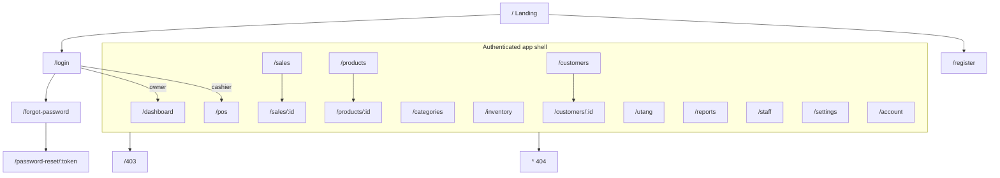
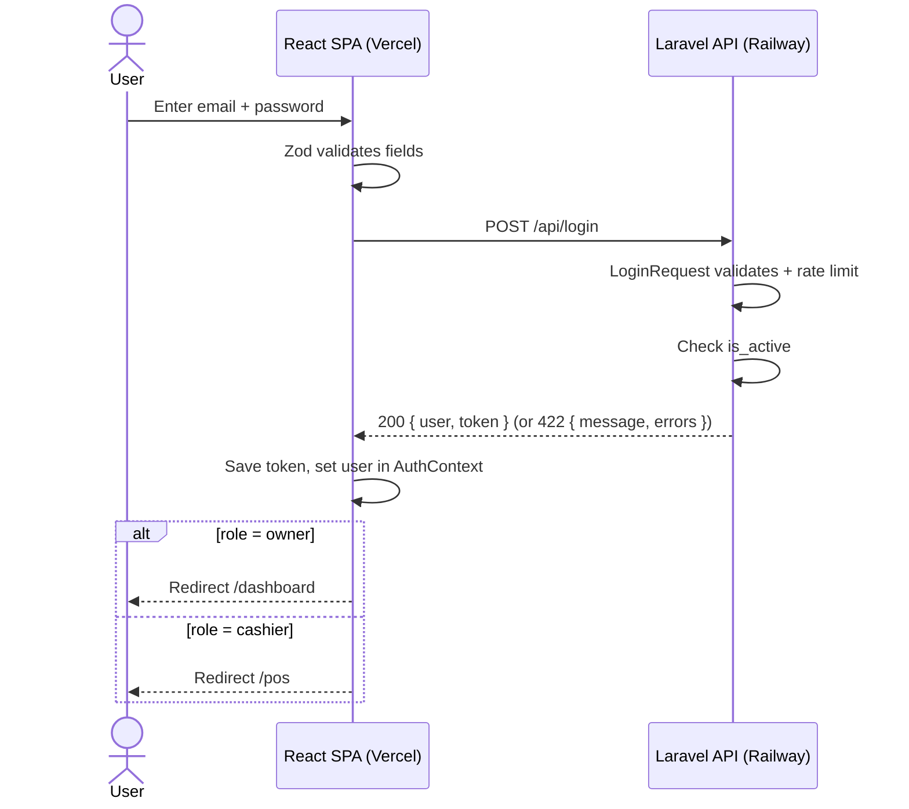
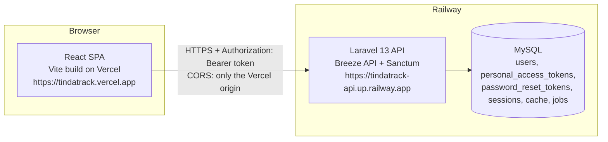

# TindaTrack — Prototype Blueprint (Research, Product Design & 3-Phase Build Plan)

> **TindaTrack: A Web-Based Point of Sale and Inventory Management System for Sari-Sari Stores**
> Integrative Programming and Technologies — React + Laravel Full-Stack Project
> Prepared for: Juan Miguel C. Morales · BSIT-IT31S1 · Blueprint date: October 7, 2026

This is the single source of truth for building the TindaTrack **prototype**. Keep it in your repo at `docs/TINDATRACK_BLUEPRINT.md` and keep `AGENTS.md` at the repo root so Antigravity reads both on every task.

**Prototype rule:** the only real database in this foundation is **authentication** (Laravel Breeze API + Sanctum + role/active middleware). Every business feature (products, POS, sales, customers, utang, reports) runs on **front-end mock data** behind a service layer that already speaks Laravel's response shapes, so swapping to real endpoints later changes one folder, not the UI.

---

## Table of Contents

0. [How to use this blueprint](#0-how-to-use-this-blueprint)
1. [Research findings and key decisions](#1-research-findings-and-key-decisions)
2. [Requirements traceability](#2-requirements-traceability)
3. [Product definition](#3-product-definition)
4. [Information architecture](#4-information-architecture)
5. [Layouts and responsive strategy](#5-layouts-and-responsive-strategy)
6. [Key user flows](#6-key-user-flows)
7. [Page specifications](#7-page-specifications)
8. [Design system](#8-design-system)
9. [Component inventory](#9-component-inventory)
10. [Library stack](#10-library-stack)
11. [Folder structure](#11-folder-structure)
12. [Mock data and service layer](#12-mock-data-and-service-layer)
13. [PHASE 1 — Installation, auth, connection, deployment](#13-phase-1--installation-auth-connection-deployment)
14. [PHASE 2 — shadcn, restructure, reusable components, mock data, responsive UI](#14-phase-2--shadcn-restructure-reusable-components-mock-data-responsive-ui)
15. [PHASE 3 — Polish](#15-phase-3--polish)
16. [Team workflow for 5 members](#16-team-workflow-for-5-members)
17. [Troubleshooting](#17-troubleshooting)
18. [After the prototype: the road to the real API](#18-after-the-prototype-the-road-to-the-real-api)
19. [Sources](#19-sources)

---

## 0. How to use this blueprint

1. Create an empty folder `tindatrack/`, open it in **Google Antigravity**.
2. Put this file at `tindatrack/docs/TINDATRACK_BLUEPRINT.md` and `AGENTS.md` at `tindatrack/AGENTS.md`.
3. Run the phases **in order**. Each phase has: what you get, the raw commands (so you understand and can present them), a checklist, and **ready-to-paste Antigravity prompts** (the `~~~` blocks).
4. Paste one prompt at a time in the Agent panel. Use **Planning mode** for big prompts, read the plan artifact it proposes, approve, then let it run. Commit after each prompt passes its checklist.
5. If a prompt is too big for the agent in one go, it is already split into numbered sub-prompts (1A, 1B, 1C, 2A…). Never skip a sub-prompt.

> **Tip:** When the agent says "done", verify with the checklist yourself. Agents are fast but they do not always run the app. Ask it: *"Run the dev servers and open the browser to verify"* if it skipped that.

---

## 1. Research findings and key decisions

### 1.1 What the 2026 ecosystem looks like (verified October 2026)

| Topic | Finding | Impact on TindaTrack |
|---|---|---|
| Laravel | **Laravel 13** (released March 17, 2026) requires **PHP 8.3–8.5**. Laravel 12 is still supported (security fixes until Feb 2027). | Use Laravel 13. Check `php -v` ≥ 8.3 before starting. |
| Breeze | Laravel 12+ installer no longer offers Breeze, but `laravel/breeze` **v2.4.x still supports Laravel 11, 12 and 13** and is still maintained. Breeze's `api` stack runs `php artisan install:api` (installs Sanctum), copies auth controllers/requests/middleware, `routes/auth.php`, `config/cors.php`, adds `FRONTEND_URL`, and **deletes** Laravel's own Vite/Blade frontend files. | Install with `composer require laravel/breeze --dev` → `php artisan breeze:install api`. Perfect for a separate React app. |
| Breeze API auth mode | Out of the box Breeze API uses **Sanctum SPA cookie** auth (session + CSRF). That needs frontend and backend on the **same top-level domain**. `*.vercel.app` and `*.up.railway.app` are different sites, so the session cookie becomes a blocked third-party cookie in production. | **Decision:** keep Breeze's scaffolding, but convert login/register/logout to **Sanctum bearer tokens** (matches your proposal: "authentication token in the request header"). Works across any two domains. |
| Sanctum | `php artisan install:api` installs Sanctum + `routes/api.php`; `HasApiTokens` on `User`; `createToken()->plainTextToken`; `currentAccessToken()->delete()` to log out; token expiration configurable. | Implemented in Phase 1. |
| React tooling | **Vite 8** (Rolldown-powered). Needs a current Node LTS (use **Node 22 or 24 LTS**). Templates: `react` (JS) and `react-ts`. | `npm create vite@latest frontend -- --template react`. |
| Tailwind | **Tailwind CSS v4** with the `@tailwindcss/vite` plugin and `@import "tailwindcss";` (no `tailwind.config.js`). | Installed in Phase 1, themed in Phase 2. |
| React Router | **React Router v8** (June 2026). `react-router-dom` is gone — import everything from `react-router`. Requires **React 19.2.7+**. | Data mode: `createBrowserRouter` + `RouterProvider`. |
| shadcn/ui | CLI v4. **Base UI is now the default** (July 2026); Radix is still fully supported via `-b radix`. New styles: Vega (classic), Nova (compact), Maia (soft/rounded), Lyra (sharp), Mira (dense). New components: Field, Input Group, Button Group, Empty, Item, Kbd, Spinner, Native Select, Combobox, Questionnaire, Toast. **Sonner's docs page now redirects to the new Toast component.** Since Sep 2026 `cn` comes from a tiny `cn` package (still re-exported from `@/lib/utils`). JavaScript is supported (`"tsx": false`). Namespaced community registries work with `npx shadcn add @namespace/item`. | **Decision:** `-b radix` + style **Vega**. Reason: Radix + `asChild` is what most tutorials, community registries and AI coding agents (including Antigravity's models) were trained on, so far fewer broken generations. |
| Animation | `framer-motion` is now **Motion** (`npm i motion`, `import { motion } from "motion/react"`). | Used in Phase 3 polish. |
| Avatars | **DiceBear 10.x** changed its JS API (styles moved to `@dicebear/styles`; `Style` + `Avatar` classes). 9.x used `createAvatar` + `@dicebear/collection`. | All avatar code lives in **one file** (`src/lib/avatar.js`) so whichever version installs, only that file adapts. |
| Antigravity | Reads workspace rules from `AGENTS.md` / `GEMINI.md` at the root or `.agents/rules/` (12,000-char limit per rules file). Supports `@file` references. | Ship an `AGENTS.md` (< 12k chars) with the stack rules. |
| Deployment | Railway auto-detects Laravel (Railpack, php-fpm + Caddy), supports a MySQL service and `${{Service.VAR}}` variable references, root-directory per service, and pre-deploy commands. Vercel deploys a Vite SPA with a `vercel.json` rewrite for deep links. | Frontend → **Vercel**, Backend + MySQL → **Railway**. Same GitHub repo, two independent deployments. |

### 1.2 Architecture Decision Records (ADR)

| # | Decision | Why | Trade-off |
|---|---|---|---|
| ADR-01 | **Monorepo, two apps**: `backend/` (Laravel API) and `frontend/` (React SPA) in one Git repo | One place for 5 members, one PR history, each host deploys only its folder ("separate deployments, still connected") | Must set Root Directory on each host |
| ADR-02 | **Laravel = API only** (Breeze `api` stack) | Clean separation; React owns 100% of UI | No Blade pages |
| ADR-03 | **Sanctum bearer tokens**, not SPA cookies | Works across `vercel.app` ↔ `railway.app`; matches proposal | Token in `localStorage` is readable by JS → keep XSS surface low (no `dangerouslySetInnerHTML`), tokens expire in 7 days |
| ADR-04 | **JavaScript (.jsx)**, not TypeScript | The course rubric literally lists "JSX"; easier for all 5 members; shadcn supports JS via `"tsx": false`; Zod gives runtime validation | Fewer compile-time checks → we compensate with Zod schemas + JSDoc typedefs on mock models |
| ADR-05 | **shadcn/ui on Radix, style Vega** | Most compatible with docs, registries, and AI agents | Base UI is the newer default; we can migrate later with `shadcn migrate` |
| ADR-06 | **Mock data behind a service layer** shaped exactly like Laravel responses (`{ data, meta }`, 422 `{ message, errors }`) | Phase 4 swap = replace service bodies with axios calls; UI untouched | Slightly more code now |
| ADR-07 | **TanStack Query** for all data reads/writes (even mocks) | Real loading/error/caching states now; identical when API arrives | One more library to learn |
| ADR-08 | **Auth state in React Context (`useContext`)**, UI/cart state in Zustand | Proposal explicitly promises `useContext` for the logged-in user; Zustand keeps the cart simple and persistent | Two state tools, each with a clear job |
| ADR-09 | **Role + active-status middleware** on the API, mirrored by a front-end permission map | Owner vs Cashier enforced on both sides | Must keep both maps in sync (documented in §3.3) |
| ADR-10 | **Mobile-first, phone-usable POS** | Most sari-sari owners run the store from an Android phone | POS needs separate mobile layout (cart drawer) |

---

## 2. Requirements traceability

Every course requirement and every proposal promise is mapped to where it is satisfied.

| Course / proposal requirement | Where it lives | Phase |
|---|---|---|
| ReactJS frontend | `frontend/` (Vite + React 19) | 1 |
| Laravel backend/API | `backend/` (Laravel 13, Breeze API) | 1 |
| MySQL database | Local MySQL + Railway MySQL (users, tokens, sessions, cache, jobs, password resets) | 1 |
| Cloud deployment, both links accessible | Vercel (frontend) + Railway (backend + MySQL) | 1 (skeleton) → 3 (final) |
| Components, JSX, Props | All UI; e.g. `ProductTile` receives `product`, `onAdd` props | 2 |
| State | `useState` (forms, filters, dialogs), Zustand (cart), TanStack Query (server state) | 1–2 |
| Event handling | `onClick` add-to-cart, `onChange` search, `onSubmit` forms, keyboard shortcuts | 1–3 |
| React Hooks | `useState`, `useEffect`, `useContext`, `useMemo`, `useCallback`, `useRef`, custom hooks (`useAuth`, `useDebounce`, `usePermissions`, `useIsMobile`, `useProducts`…) | 1–3 |
| API communication | Axios instance + interceptors → real `/api/login`, `/api/register`, `/api/user`, `/api/logout`, `/api/ping`, `/api/owner/ping` | 1 |
| Laravel: routes, controllers, models, validation, DB ops, business logic | Auth controllers, Form Requests (`LoginRequest`), `User` model + enum, migrations, seeders, middleware | 1 |
| Complete CRUD from React | Prototype: CRUD UIs for products, categories, customers, sales (mock). Real auth create/read. Real business CRUD = after prototype (§18) | 2 (UI) |
| ≥ 2 additional functions | Authentication, role-based access, search, filter, sort, pagination, status management (active/inactive, voided), categories, dashboard, reports — **10 extras** | 1–3 |
| Input validation (front + back) | Laravel Form Requests/validators on auth; Zod + React Hook Form on every form | 1–2 |
| Usable interface on desktop and mobile | Responsive shells, POS mobile drawer, cards-on-mobile tables, 44px touch targets | 2–3 |
| Live demo | Seeded demo accounts + "Reset demo data" button + demo script (§15.6) | 3 |
| Proposal feature 1: Auth & roles | Breeze API + tokens + `role` / `active` middleware | 1 |
| Proposal features 2–12 (products, categories, POS, auto stock update, sales history + void, customers, utang ledger, search/filter/sort/paginate, low-stock alerts, dashboard & reports, validation) | Pages in §7, running on mock services that apply the same business rules | 2 |

---

## 3. Product definition

### 3.1 Personas

**Aling Nena — Store Owner (primary)**
48 years old. Runs "Tindahan ni Aling Nena" from the front of her house. Uses a mid-range Android phone, sometimes her son's laptop. Comfortable with Facebook and GCash, not with spreadsheets. Pain points: forgets who owes what, discovers out-of-stock items only when a customer asks, never knows her real daily income.
*Needs:* glanceable dashboard, a utang list she trusts, a restock list before going to the wholesale store, big buttons, Filipino-friendly words.

**Juan — Cashier / Store Attendant (secondary)**
19, college student, helps after class. Fast with phones. Pain points: computing change during rush hour, typing long product names.
*Needs:* 3-tap sale, search-as-you-type and barcode entry, quick-cash buttons, can record utang payments but cannot void sales or see profits.

**Suki customers (records only)**
Regular neighbors with credit balances. They never log in.

### 3.2 Design goals (what "good" means here)

1. **3-tap sale:** tap product → tap Pay → tap Confirm for an exact-cash sale.
2. **Glanceable:** the dashboard answers "How much did I earn today? Who owes me? What's running out?" without scrolling on a phone.
3. **Forgiving:** every destructive action confirms; stock can never go negative; voids are reversible records, not deletions.
4. **Familiar words:** English UI with local terms people already use — *Utang*, *Suki*, *Benta* (sales), *Tinda* (goods), *Sukli* (change) as helper labels.
5. **Works on a ₱6,000 phone:** fast first load, no heavy images, system-light animations, respects reduced-motion.

### 3.3 Roles and permission matrix

Abilities are checked in the UI with `can('ability')` and (for auth-backed routes) by API middleware.

| Ability | Owner | Cashier | Notes |
|---|:-:|:-:|---|
| `dashboard.full` | ✅ | — | Cashier sees a "My shift" dashboard variant |
| `pos.use` | ✅ | ✅ | |
| `sales.view_all` | ✅ | — | Cashier sees only own sales |
| `sales.void` | ✅ | — | Requires reason |
| `products.view` | ✅ | ✅ | |
| `products.manage` (create/edit/delete) | ✅ | — | |
| `products.view_cost` (cost price, margin) | ✅ | — | |
| `categories.manage` | ✅ | — | |
| `inventory.adjust` (restock, damage, correction) | ✅ | — | |
| `customers.view` | ✅ | ✅ | |
| `customers.manage` (create/edit) | ✅ | ✅ | Cashier can add a new suki during a sale |
| `customers.delete` | ✅ | — | Blocked if balance > 0 |
| `utang.record_payment` | ✅ | ✅ | |
| `reports.view` | ✅ | — | |
| `staff.manage` | ✅ | — | |
| `settings.manage` | ✅ | — | Store profile, receipt, defaults, reset demo data |
| `account.manage` (own profile, password, theme) | ✅ | ✅ | |

**API side (real, Phase 1):** `auth:sanctum` (logged in), `active` (account not deactivated), `role:owner` / `role:owner,cashier`.

### 3.4 Feature catalog

**MVP (must exist in the prototype)**

| # | Feature | Real or mock |
|---|---|---|
| F1 | Register (creates an Owner), login, logout, forgot/reset password, session restore on refresh | **Real** (Laravel) |
| F2 | Role-based routing + UI permissions; deactivated accounts blocked | **Real** API middleware + UI |
| F3 | Dashboard (owner & cashier variants) | Mock |
| F4 | POS: search, barcode/SKU entry, category chips, cart, quantity stepper, cash with change, utang sale, receipt | Mock |
| F5 | Automatic stock deduction on sale, restoration on void | Mock (service rule) |
| F6 | Products CRUD with search, category/status/stock filters, sort, pagination | Mock |
| F7 | Categories CRUD (with color + icon) | Mock |
| F8 | Inventory: low-stock & out-of-stock tabs, stock adjustment with reason, stock movement log, printable restock list | Mock |
| F9 | Sales history: date range, payment type, status, cashier filters; sale detail; void with reason | Mock |
| F10 | Customers CRUD + credit limit + profile | Mock |
| F11 | Utang ledger: per-customer timeline, partial/full payments, aging buckets, reminder message copy | Mock |
| F12 | Reports: daily/weekly/monthly sales, best sellers, category breakdown, cash vs utang, estimated gross profit, CSV export | Mock |
| F13 | Staff management (list, add cashier, activate/deactivate) | Mock UI (real users table exists; wiring is post-prototype) |
| F14 | Settings: store profile, receipt footer, default reorder level, theme, reset demo data | Mock (localStorage) |
| F15 | Validation everywhere (Zod + RHF), Laravel-style error shapes | Both |

**Nice-to-have (Phase 3 polish, pick what time allows)**
Command palette (Ctrl/⌘ K) · keyboard shortcuts in POS · park/hold sale · camera barcode scan · print receipt (58 mm style) · daily closing summary · notifications (low stock, overdue utang) · PWA install on phone · onboarding checklist / store setup wizard · English/Filipino microcopy toggle.

---

## 4. Information architecture

### 4.1 Sitemap



### 4.2 Route table

| Path | Page | Access | Layout | Built in |
|---|---|---|---|---|
| `/` | Landing (what TindaTrack is, SDG 1 & 8, CTA) | Public (logged-in → redirect to home) | `PublicLayout` | P2 (P1: redirect) |
| `/login` | Login | Guest only | `AuthLayout` | P1 → restyled P2 |
| `/register` | Register store owner | Guest only | `AuthLayout` | P1 → P2 |
| `/forgot-password` | Request reset link | Guest only | `AuthLayout` | P1 → P2 |
| `/password-reset/:token` | Set new password (`?email=`) | Guest only | `AuthLayout` | P1 → P2 |
| `/dashboard` | Dashboard (owner/cashier variants) | Auth | `AppLayout` | P1 placeholder → P2 |
| `/pos` | Point of Sale | Auth | `PosLayout` (focus mode) | P2 |
| `/sales` · `/sales/:id` | Sales history · detail | Auth (cashier: own) | `AppLayout` | P2 |
| `/products` · `/products/:id` | Products · detail | Auth (manage: owner) | `AppLayout` | P2 |
| `/categories` | Categories | Owner | `AppLayout` | P2 |
| `/inventory` | Stock overview, adjustments, movements, restock list | Owner | `AppLayout` | P2 |
| `/customers` · `/customers/:id` | Customers · profile + ledger | Auth | `AppLayout` | P2 |
| `/utang` | Utang overview, aging, collect payments | Auth | `AppLayout` | P2 |
| `/reports` | Reports | Owner | `AppLayout` | P2 |
| `/staff` | Staff accounts | Owner | `AppLayout` | P2 |
| `/settings` | Store settings | Owner | `AppLayout` | P2 |
| `/account` | My profile, password, appearance | Auth | `AppLayout` | P2 |
| `/403` · `*` | Forbidden · Not found | Any | `MinimalLayout` | P1 → P2 |

**Home redirect after login:** owner → `/dashboard`, cashier → `/pos` (cashiers come to sell).

### 4.3 Navigation model (`src/config/nav.js`)

| Group | Item | Icon (lucide) | Roles |
|---|---|---|---|
| Overview | Dashboard | `LayoutDashboard` | owner, cashier |
| Overview | POS | `ScanBarcode` | owner, cashier |
| Overview | Sales | `ReceiptText` | owner, cashier |
| Inventory | Products | `Package` | owner, cashier |
| Inventory | Categories | `Tags` | owner |
| Inventory | Stock | `Warehouse` | owner |
| Customers | Customers | `Users` | owner, cashier |
| Customers | Utang | `NotebookPen` | owner, cashier |
| Insights | Reports | `ChartColumn` | owner |
| Admin | Staff | `UserCog` | owner |
| Admin | Settings | `Settings` | owner |

**Mobile bottom navigation (5 slots):** Home · Products · **POS** (center, raised) · Utang · More (opens a Sheet with the remaining items + account + theme + logout).

Each nav item carries `badge` support (e.g., Stock shows low-stock count; Utang shows number of overdue accounts).

---

## 5. Layouts and responsive strategy

### 5.1 Breakpoints (Tailwind v4 defaults)

| Name | Width | Shell behavior |
|---|---|---|
| base | < 640 px (phones) | Topbar + **bottom nav**; tables become **card lists**; forms open in a bottom **Drawer**; one column |
| `sm` | ≥ 640 | Same as phone, 2-column grids allowed |
| `md` | ≥ 768 (tablets) | **Collapsible icon sidebar** (shadcn Sidebar `collapsible="icon"`), bottom nav hidden; forms in right **Sheet** |
| `lg` | ≥ 1024 (laptops) | Full sidebar; POS becomes split view (products + cart panel) |
| `xl` / `2xl` | ≥ 1280 / 1536 | Max content width `max-w-screen-2xl`, dashboard 12-col grid |

Test widths: **360, 390, 768, 1024, 1280, 1536**.

### 5.2 Shells

- **`PublicLayout`** — simple header (logo, Login, Get started), footer with SDG badges.
- **`AuthLayout`** — split screen on `lg` (left: brand panel with dot-pattern background + tagline "Ang tindahan mo, organisado na."; right: form card). Phones: single centered card.
- **`AppLayout`** — `SidebarProvider` → `AppSidebar` + `SidebarInset` { `Topbar` (sidebar trigger, breadcrumbs, global search button with `Kbd` ⌘K, notifications, theme toggle, user menu) · `<main>` with `PageContainer` · `MobileBottomNav` on phones }.
- **`PosLayout`** — focus mode: slim topbar (back to dashboard, store name, cashier avatar, clock, online indicator). No sidebar. On phones the bottom nav is replaced by the **sticky cart bar**.
- **`MinimalLayout`** — centered message pages (403/404/errors).

### 5.3 Wireframes

**Dashboard — desktop (`lg+`)**
```
┌ Sidebar ┐┌ Topbar: ☰  Dashboard        [Search ⌘K]  🔔  ◐  (avatar) ┐
│ Logo    ││ Good morning, Aling Nena            [New sale] [+ Product]│
│ Overview││ ┌Today's sales┐┌Transactions┐┌Outstanding utang┐┌Low stock┐│
│  …      ││ │ ₱3,482.00 ▲8%││ 37        ││ ₱5,120.00 (9)  ││ 7 items ││
│ Invent. ││ └─────────────┘└────────────┘└────────────────┘└─────────┘│
│  …      ││ ┌ Sales trend (7d | 30d) ─────────────┐┌ Cash vs Utang ┐  │
│ Customers│ │  area chart                         ││  donut        │  │
│  …      ││ └─────────────────────────────────────┘└───────────────┘  │
│ Insights││ ┌ Top sellers ────┐┌ Running low ─────┐┌ Recent sales ──┐ │
│ Admin   ││ │ 1 Pancit Canton ││ Coke Mismo  3/12 ││ TT-…-0037 ₱45  │ │
└─────────┘└───────────────────────────────────────────────────────────┘
```

**Dashboard — phone**
```
┌ ☰ TindaTrack            🔔 (A) ┐
│ Good morning, Aling Nena       │
│ ┌Sales today┐ ┌Transactions┐   │
│ │ ₱3,482 ▲8%│ │ 37         │   │
│ ┌Utang      ┐ ┌Low stock   ┐   │
│ │ ₱5,120    │ │ 7          │   │
│ [ Start selling → ]            │
│ Sales trend (7d) ▁▃▅▂▆▇        │
│ Running low  (list, 5)         │
│ Recent sales (list, 5)         │
├────────────────────────────────┤
│ Home  Products (POS) Utang More│
└────────────────────────────────┘
```

**POS — desktop (`lg+`)**
```
┌ ← Dashboard  Tindahan ni Aling Nena      Juan · 10:42 AM  ● Online ┐
│ [🔍 Search or scan barcode…  F2]                                    │
│ (All)(Drinks)(Snacks)(Noodles)(Canned)(Condiments)(Household) →    │
│ ┌────────┐┌────────┐┌────────┐┌────────┐ │ Cart (4 items)    Clear │
│ │Pancit  ││Coke    ││Piattos ││Ligo    │ │ Pancit Canton  [-2+] 40│
│ │Canton  ││Mismo   ││Cheese  ││Sardines│ │ Coke Mismo     [-1+] 25│
│ │₱20  ·56││₱25 · 3!││₱22 ·18 ││₱28 ·24 │ │ …                       │
│ └────────┘└────────┘└────────┘└────────┘ │ Subtotal          ₱93.00│
│  … grid (4–6 columns) …                  │ TOTAL           ₱93.00  │
│                                          │ [Hold]  [ Pay  F9 ]     │
└──────────────────────────────────────────┴─────────────────────────┘
```

**POS — phone**
```
┌ ← POS                    (J) ┐
│ [🔍 Search or scan…]  [📷]   │
│ (All)(Drinks)(Snacks) →      │
│ ┌──────────┐┌──────────┐     │
│ │Pancit    ││Coke Mismo│     │
│ │₱20 · 56  ││₱25 · 3 ! │     │
│ └──────────┘└──────────┘     │
│ … 2-column grid …            │
├──────────────────────────────┤
│ 🛒 4 items   ₱93.00  [Pay →] │  ← sticky cart bar, tap = cart Drawer
└──────────────────────────────┘
```

### 5.4 Responsive rules the agent must follow

- Write **mobile-first** classes (`grid-cols-2 md:grid-cols-3 lg:grid-cols-5`), never desktop-first.
- Every data table has a **mobile card renderer** (`renderMobileCard`) used below `md`.
- Every create/edit form uses **`ResponsiveDialog`** (Dialog/Sheet on `md+`, Drawer on phones).
- Touch targets **≥ 44×44 px**; inputs **≥ 16 px font** on phones (prevents iOS zoom).
- No horizontal page scroll at 360 px. Horizontal scroll is allowed only inside chip rows and wide tables (`ScrollArea`).
- Use `dvh` units for full-height mobile layouts (address bar safe), and `pb-[env(safe-area-inset-bottom)]` on the bottom nav.

---

## 6. Key user flows

### 6.1 Login and role-based landing (real API)



### 6.2 Cash sale (mock)
1. Cashier opens **POS** → types "canton" or scans a barcode → taps the tile (adds 1; tile shows a quick "+1" pulse).
2. Adjusts quantity with the stepper (cannot exceed stock; the button disables and a hint says "Only 3 left").
3. Taps **Pay** (or F9) → **Payment dialog** opens on the **Cash** tab.
4. Taps **Exact** or **₱100** quick-cash → **Change (Sukli)** shows instantly in large digits.
5. **Confirm** → service creates the sale, deducts stock, returns the receipt → success state with receipt preview → **New sale** (Enter) clears the cart.

### 6.3 Utang sale (mock)
Steps 1–3 as above → **Utang** tab → search customer (Combobox) or **+ New suki** inline → shows current balance → optional "Paid now" amount → warning if new balance exceeds credit limit (owner can override, cashier cannot) → Confirm → balance increases, ledger entry created.

### 6.4 Record utang payment
From **Utang** list (quick "Collect" button) or **Customer profile** → Payment dialog: amount (defaults to full balance, quick buttons ₱50/₱100/Full), date, note → Confirm → balance decreases → ledger timeline updates → toast "Payment of ₱200.00 recorded for Aling Rosing".

### 6.5 Add product / restock
Products → **+ Add product** → ResponsiveDialog form (name, category, SKU/barcode, price, cost, stock, reorder level, unit, active) → validation (price ≥ 0, SKU unique, cost ≤ price shows a warning) → save → toast + row highlight.
Restock: Stock page → **Running low** tab → **Restock** on a row (or bulk select) → quantity + reason "Restock" → movement logged.

### 6.6 Void a sale (owner)
Sales → open sale → **Void sale** → AlertDialog with required reason → service marks `status: voided`, restores stock, reverses utang if applicable → status badge turns gray with strike-through total.

### 6.7 Low stock to restock list
Dashboard "Running low" card or notification bell → Stock page → **Restock list** tab → printable checklist grouped by category with suggested quantities (`reorder_level × 2 − stock`).

---

## 7. Page specifications

Each page must implement **four states**: loading (skeletons matching final layout), empty (EmptyState with a helpful CTA), error (Alert with Retry), and data.

### 7.1 Landing `/`
Hero (headline "Benta, stock, at utang — sa isang app.", sub-copy in English, CTA **Get started** / **Log in**), animated product-tile mock of the POS, 3 feature cards (Fast POS, Utang ledger, Smart stock alerts), SDG 1 & SDG 8 strip, footer with team credits. Keep it one screen tall on desktop plus 2 sections; it is a demo asset, not a marketing site.

### 7.2 Auth pages
- **Login:** email, password (show/hide toggle via InputGroup), "Remember this device" (longer token name only), submit with Spinner, links to Register / Forgot. Demo-account helper (collapsible) that fills `owner@tindatrack.test` / `cashier@tindatrack.test` — show only when `import.meta.env.VITE_SHOW_DEMO_ACCOUNTS === 'true'`.
- **Register:** store owner name, email, password + confirm with strength meter (Progress), terms checkbox. Creates an **owner**.
- **Forgot password:** email → success state "Check your email" (local mail goes to `storage/logs/laravel.log`).
- **Reset password:** reads `:token` and `?email=`, new password + confirm.
- Server 422 errors map to fields; 429 shows "Too many attempts, try again in N seconds".

### 7.3 Dashboard `/dashboard`
**Owner:** greeting by time of day · date-range toggle (Today / 7 days / 30 days) · KPI row: Sales (with % vs previous period, NumberTicker), Transactions, Outstanding Utang (with count of debtors), Low/Out of stock · Sales trend (Area chart) · Payment mix (Donut: cash vs utang) · Top 5 sellers (ranked list with Progress bars) · Running low (5 rows + Restock CTA) · Recent sales (5 rows) · Quick actions (New sale, Add product, Record payment).
**Cashier:** "My shift today" (my sales total, my transactions) · big **Start selling** CTA · Running low (read-only) · My recent sales.

### 7.4 POS `/pos`
Search input (autofocus, F2; Enter on an exact SKU/barcode adds immediately) · category chips (ToggleGroup in a horizontal ScrollArea) · product grid tiles (name, price, stock badge: green/amber/red, disabled when out of stock; long-press/right-click → ContextMenu "View product") · cart panel (desktop) / cart Drawer (phone) · line items with QuantityStepper and remove · Clear cart (confirm) · **Hold sale** (park up to 3 carts — Phase 3) · Pay → PaymentDialog (Cash/Utang tabs) → ReceiptView (store header, sale no., date, cashier, items, totals, cash, change, footer "Salamat po! Balik po kayo!") with Print & New sale.
Cart persists in Zustand (`localStorage`) so a refresh never loses a sale.

### 7.5 Products `/products` and `/products/:id`
DataTable (server-mode): columns Product (thumb + name + SKU), Category, Price, Cost (owner), Stock (StockLevelBar + number), Status (Active/Inactive), Updated, actions (View, Edit, Adjust stock, Duplicate, Delete). Toolbar: debounced search, faceted filters (Category, Stock level: In stock/Low/Out, Status), column visibility, page size; URL-synced params (`?q=&category=&stock=low&page=2&sort=-price`).
Detail: header with actions, info card, pricing card (margin %, owner only), stock card with movement history (Table), 30-day sales mini chart, recent sales of this product.
Form (ResponsiveDialog): name*, category*, SKU, barcode, unit (pc, pack, sachet, bottle, can, cup, kg, L), price*, cost (owner), stock* (create only; afterwards changes go through Adjust stock), reorder level*, active switch, description.

### 7.6 Categories `/categories`
Card grid: color chip + lucide icon + name + product count + actions. Form: name*, description, color (preset swatches), icon (preset picker). Delete blocked if products exist (Alert explains and links to filtered products).

### 7.7 Stock `/inventory`
Tabs: **Overview** (stock value at cost, at retail, counts by status) · **Running low** (low + out, bulk restock) · **Movements** (log: date, product, type `sale | void | restock | damage | correction`, qty ±, by, note; filter by type/date) · **Restock list** (printable).

### 7.8 Sales `/sales` and `/sales/:id`
DataTable: Sale no., Date/time, Cashier (avatar), Customer, Items, Payment (Cash/Utang badge), Total, Status (Completed/Voided). Filters: DateRangePicker (Calendar in Popover, presets Today/Yesterday/7d/30d/This month), payment type, status, cashier (owner). Summary strip above table (total, count, average sale) for the filtered range.
Detail: receipt-style card, items table, payment info, audit (created by, voided by + reason), actions Print, Void (owner).

### 7.9 Customers `/customers` and `/customers/:id`
List with avatar (DiceBear initials/notionists by name), name + nickname ("Aling Rosing"), contact, address (purok/barangay), balance badge (0 → muted, > 0 → amber, over limit → red), last activity. Filters: "With balance", "Over limit". Form: name*, nickname, contact (PH mobile format 09XX-XXX-XXXX), address, credit limit, notes.
Profile: header (avatar, balance big, credit-limit Progress), actions Record payment / Edit / Delete (owner, blocked if balance > 0), **Ledger timeline** (utang purchases and payments with running balance), purchase history table.

### 7.10 Utang `/utang`
KPIs: total outstanding, debtors count, collected this week, overdue (> 30 days). Aging buckets (0–7, 8–30, 31–60, 60+) as stacked bar. Debtors table (sort by balance/oldest), quick **Collect** action, **Copy reminder** (prefilled polite Taglish SMS: "Hi Aling Rosing, paalala lang po sa utang ninyo na ₱320.00 sa Tindahan ni Aling Nena. Salamat po!").

### 7.11 Reports `/reports` (owner)
Range picker + granularity (Daily/Weekly/Monthly). Sections: Sales over time (Bar), Gross profit estimate (price − cost), Best sellers (table + bar), Category breakdown (Pie or Bar), Cash vs Utang trend, Hourly heatmap-ish bar (busiest hours). **Export CSV** per section; **Print** layout.

### 7.12 Staff `/staff` (owner)
List of users (avatar, name, email, role badge, status switch, last login). Add cashier dialog (name, email, temp password), deactivate/reactivate with confirm. *Prototype: mock list seeded with the same people as the real seeded users. Real wiring after prototype.*

### 7.13 Settings `/settings` (owner) and Account `/account`
Settings tabs: Store profile (name, owner, address, contact, logo initials), Receipt (header line, footer message, show cashier name), Inventory defaults (default reorder level, low-stock threshold %), Data (Reset demo data — confirm dialog).
Account: profile (name, email — read-only from real API), change password (UI only in prototype), appearance (Light/Dark/System), sign out of this device.

### 7.14 System pages
403 ("This page is for the store owner"), 404 (friendly illustration + "Back to dashboard"), route error boundary (shows message + Reload), offline banner (Phase 3).

---
## 8. Design system

### 8.1 Brand personality
**Friendly, trustworthy, local, fast.** Think of a clean, freshly painted tindahan sign: warm off-white background, a calm "money green" for trust, and a mango accent for warmth and highlights. No gradients-everywhere, no glassmorphism — clarity first, delight in small moments.

### 8.2 Color tokens (all AA-checked)

| Token | Light | Dark | Use |
|---|---|---|---|
| `--background` | `#FAFAF7` → `oklch(0.984 0.004 106.5)` | `#0C0F0E` → `oklch(0.165 0.005 173.6)` | App background (warm, not pure white) |
| `--foreground` | `#1C1917` → `oklch(0.216 0.006 56)` | `oklch(0.97 0.003 106)` | Body text |
| `--card` | `oklch(1 0 0)` | `oklch(0.205 0.006 173)` | Cards, panels |
| `--primary` | **Tinda Green** `#0E7C66` → `oklch(0.525 0.097 174.1)` | `#2DD4AA` → `oklch(0.779 0.144 170.7)` | Primary buttons, active nav, links, focus ring |
| `--primary-foreground` | `oklch(0.985 0 0)` (white, 5.13:1) | `oklch(0.2 0.03 175)` | Text on primary |
| `--highlight` | **Mango** `#F5A524` → `oklch(0.782 0.158 72.3)` | same | Badges, POS total accent, landing highlights |
| `--highlight-foreground` | `#3B2400` → `oklch(0.283 0.06 73.4)` (7.15:1) | same | Text on mango |
| `--success` | `#15803D` → `oklch(0.527 0.137 150.1)` | `oklch(0.72 0.17 150)` | In stock, completed, payment received |
| `--warning` | `#C2410C` → `oklch(0.553 0.174 38.4)` | `oklch(0.72 0.17 45)` | Low stock, over credit limit |
| `--utang` | `#B45309` → `oklch(0.555 0.146 49)` | `oklch(0.75 0.15 60)` | Utang amounts and badges |
| `--info` | `#0369A1` → `oklch(0.5 0.119 242.7)` | `oklch(0.72 0.12 240)` | Info alerts, tips |
| `--destructive` | `#DC2626` → `oklch(0.577 0.215 27.3)` | `oklch(0.65 0.2 25)` | Delete, void, out of stock |
| `--chart-1…5` | primary · mango · info · utang · `oklch(0.55 0.18 295)` violet | lighter variants | Charts in this fixed order |

Semantic rule: **color is never the only signal** — status badges always include an icon or text (e.g., ⚠ "Low · 3 left").

Register the custom tokens in `src/index.css` with Tailwind v4 `@theme inline` so classes like `bg-success`, `text-utang`, `bg-highlight` work:

```css
@theme inline {
  --color-highlight: var(--highlight);
  --color-highlight-foreground: var(--highlight-foreground);
  --color-success: var(--success);
  --color-warning: var(--warning);
  --color-utang: var(--utang);
  --color-info: var(--info);
  --font-sans: "Plus Jakarta Sans Variable", ui-sans-serif, system-ui, sans-serif;
  --font-mono: "Geist Mono Variable", ui-monospace, monospace;
}
```

### 8.3 Typography
- **UI font:** Plus Jakarta Sans Variable (friendly geometric, great at small sizes) via `@fontsource-variable/plus-jakarta-sans` — self-hosted, no Google Fonts request.
- **Mono font:** Geist Mono Variable for SKUs, sale numbers, receipts.
- **Numbers:** always `tabular-nums` for prices, totals, quantities so columns don't jiggle.
- **Scale:** 12 / 14 / 16 (base) / 18 / 20 / 24 / 30; KPI values 30–36 semibold; page titles 24 (mobile) → 30 (desktop).
- **Currency:** `new Intl.NumberFormat('en-PH', { style: 'currency', currency: 'PHP' })` → `₱1,234.50`. Dates: `date-fns` with `Asia/Manila` display, e.g. "Oct 7, 2026 · 10:42 AM".

### 8.4 Shape, spacing, elevation
`--radius: 0.75rem` (friendly). Spacing on the 4-px grid; page padding `px-4 md:px-6 lg:px-8`; section gap `gap-4 md:gap-6`. Elevation: borders first, `shadow-xs` on cards, `shadow-lg` only for floating elements (cart bar, popovers).

### 8.5 Iconography, avatars, illustrations
- **Icons:** `lucide-react` only (installed by shadcn) for consistency; 16 px in dense UI, 20 px in nav, 24 px in empty states. Optional animated icons from the `@animateicons` / Animate UI registries for 2–3 delight spots only.
- **Avatars:** DiceBear — `initials` style for staff (clean, professional) and `notionists` (or `thumbs`) for customers, seeded by name, always with `AvatarFallback` initials.
- **Product thumbnails:** no photos in the prototype. Use a colored tile with the category icon + first letters ("PC" for Pancit Canton) — fast, consistent, offline-friendly.
- **Empty-state illustrations:** unDraw SVGs recolored to `#0E7C66` (download, place in `src/assets/illustrations/`), or a large lucide icon inside the shadcn `Empty` component.

### 8.6 Motion
Library: **Motion** (`motion/react`) + `tw-animate-css` (installed by shadcn) + `@formkit/auto-animate` for list add/remove.
Durations: 120 ms (hover/press), 200 ms (popovers, toasts), 300 ms (page/section entrance). Easing: ease-out for entrances, spring (`stiffness 400, damping 30`) for the cart "+1" bump. Page entrances: fade + 8 px rise, staggered 40 ms for cards. **Always** respect `prefers-reduced-motion` (`useReducedMotion()` → no transforms).

### 8.7 Microcopy
Short, warm, specific. Buttons are verbs ("Record payment", not "Submit"). Errors say what to do ("Price can't be negative. Enter 0 or more."). Local terms appear as helper text or badges: *Sukli* under "Change", *Utang* as the module name, *Suki* for regular customers. Toasts: "Sale TT-20261007-0012 saved · ₱93.00".

### 8.8 Accessibility checklist
AA contrast (verified above) · visible focus rings (`ring-ring`) · every icon-only button has `aria-label` + Tooltip · forms use `Field` + `FieldLabel` + `FieldError` (linked with `aria-describedby`) · dialogs trap focus (Radix does) · keyboard path for the full POS flow · `lang="en"` and page `<title>` per route · motion reduced when requested.

---

## 9. Component inventory

### 9.1 shadcn/ui components (53) — install all in Phase 2

| # | Component | Used in TindaTrack for |
|---|---|---|
| 1 | `accordion` | Landing FAQ, Settings help sections |
| 2 | `alert` | Inline errors, low-stock warnings, info tips |
| 3 | `alert-dialog` | Delete product/category/customer, void sale, clear cart, reset demo data |
| 4 | `aspect-ratio` | Product tile thumbnails, landing preview |
| 5 | `avatar` | Users, customers (DiceBear) |
| 6 | `badge` | Stock status, payment type, role, sale status |
| 7 | `breadcrumb` | Topbar location (Products › Pancit Canton) |
| 8 | `button` | Everywhere |
| 9 | `button-group` | Quick-cash buttons, date presets, view toggles |
| 10 | `calendar` | Date range filters, payment date |
| 11 | `card` | KPI cards, panels, forms |
| 12 | `carousel` | Landing screenshots, mobile KPI swipe (optional) |
| 13 | `chart` | Sales trend, payment mix, reports (Recharts) |
| 14 | `checkbox` | Table row selection, bulk restock, terms |
| 15 | `collapsible` | Sidebar groups, demo-accounts helper |
| 16 | `combobox` | Customer picker in POS, category picker |
| 17 | `command` | Command palette (⌘K), searchable lists |
| 18 | `context-menu` | Right-click / long-press on POS tiles and table rows |
| 19 | `dialog` | Payment, receipt, forms on desktop |
| 20 | `drawer` | Mobile cart, mobile forms (vaul) |
| 21 | `dropdown-menu` | Row actions, user menu, export menu |
| 22 | `empty` | Empty states on every list |
| 23 | `field` | Form layout, labels, descriptions, errors (with React Hook Form) |
| 24 | `hover-card` | Customer balance preview on hover (desktop) |
| 25 | `input` | Text inputs |
| 26 | `input-group` | ₱ prefix money input, search with icon + Kbd, password toggle |
| 27 | `input-otp` | Optional cashier PIN quick-switch (Phase 3 idea) |
| 28 | `item` | List rows: top sellers, low stock, recent sales, notifications |
| 29 | `kbd` | Shortcut hints (F2, F9, ⌘K) |
| 30 | `label` | Form labels |
| 31 | `native-select` | Page-size select, simple selects on mobile (native picker UX) |
| 32 | `navigation-menu` | Landing header |
| 33 | `pagination` | Table pagination |
| 34 | `popover` | Date picker, filters, notifications |
| 35 | `progress` | Credit-limit usage, password strength, top-seller bars |
| 36 | `radio-group` | Payment method, report granularity |
| 37 | `resizable` | POS split (products ↔ cart) on large screens |
| 38 | `scroll-area` | Cart list, category chip row, wide tables |
| 39 | `select` | Category, unit, role selects |
| 40 | `separator` | Layout dividers, receipt lines |
| 41 | `sheet` | Desktop side forms, mobile "More" menu |
| 42 | `sidebar` | App navigation (collapsible icon mode) |
| 43 | `skeleton` | Loading states |
| 44 | `slider` | Price range filter, low-stock threshold setting |
| 45 | `spinner` | Button loading, inline loading |
| 46 | `switch` | Active/inactive, settings toggles |
| 47 | `table` | Base for DataTable |
| 48 | `tabs` | Payment dialog, Stock page, Settings, Reports |
| 49 | `textarea` | Notes, void reason, descriptions |
| 50 | `toast` | Success/error notifications (replaces Sonner in current shadcn) |
| 51 | `toggle` | Favorite product, grid/list switch |
| 52 | `toggle-group` | Category chips, range toggle (Today/7d/30d) |
| 53 | `tooltip` | Icon buttons, truncated text |

**Patterns (not CLI items, built from the above):** *Data Table* (table + TanStack Table), *Date Picker / Date Range Picker* (popover + calendar), *Form* (field + React Hook Form + Zod), *Theme toggle* (dropdown-menu + custom ThemeProvider for Vite).

**Optional extras:** `questionnaire` (first-run store setup wizard, Phase 3), `menubar` (not needed).

### 9.2 Community registry components (optional delight, via the same CLI)

Check each before adding: `npx shadcn@latest view @magicui/number-ticker`.

| Item | Command | Where |
|---|---|---|
| Number Ticker | `npx shadcn@latest add @magicui/number-ticker` | Dashboard KPI values |
| Blur Fade | `npx shadcn@latest add @magicui/blur-fade` | Staggered section entrances |
| Animated List | `npx shadcn@latest add @magicui/animated-list` | "Live" recent sales feed on dashboard |
| Dot Pattern | `npx shadcn@latest add @magicui/dot-pattern` | Auth brand panel / landing background |
| Border Beam | `npx shadcn@latest add @magicui/border-beam` | Landing POS preview card |
| Animated Shiny Text | `npx shadcn@latest add @magicui/animated-shiny-text` | Landing badge "Built for sari-sari stores" |
| Confetti | `npx shadcn@latest add @magicui/confetti` | Celebrate first sale of the day (once, subtle) |
| Data table filters (OpenStatus) | browse `@data-table-filters` | Inspiration for advanced Sales filters |
| Animated icons | browse `@animateicons` / `@animate-ui` | 2–3 icons max (bell, cart) |

### 9.3 Custom reusable components (build once, use everywhere)

**Layout** — `AppLayout`, `AuthLayout`, `PosLayout`, `PublicLayout`, `MinimalLayout`, `AppSidebar`, `NavMain` (renders `nav.js` filtered by role), `NavUser`, `Topbar`, `MobileBottomNav`, `MoreSheet`, `PageHeader` (title, description, actions slot, breadcrumbs), `PageContainer`, `SectionCard`.

**Data display** — `StatCard` (icon, label, value, delta, tone, loading), `ChartCard`, `TrendBadge` (▲/▼ %), `Money` (formats ₱, `tabular-nums`, tones), `StatusBadge` (config-driven: stock/sale/payment/role/active), `StockLevelBar`, `UserAvatar` (DiceBear + fallback), `ProductThumb` (category color + icon + initials), `EmptyState` (wraps `Empty`), `ErrorState` (Alert + Retry), `TableSkeleton`, `CardGridSkeleton`, `KeyValueList`, `Timeline` (ledger/movements), `ReceiptView`.

**Data table kit** (`src/components/data-table/`) — `DataTable` (props: `columns`, `data`, `meta`, `isLoading`, `params`, `onParamsChange`, `renderMobileCard`, `toolbar`, `onRowClick`, `enableSelection`), `DataTableToolbar`, `DataTableColumnHeader` (sortable), `DataTableFacetedFilter`, `DataTableViewOptions`, `DataTablePagination`, `DataTableRowActions`, `useTableParams` (syncs with URL search params).

**Forms** (`src/components/forms/`) — `FormInput`, `FormTextarea`, `FormSelect`, `FormSwitch`, `FormCheckbox` (all RHF `Controller` + `Field`), `MoneyInput` (₱ InputGroup, decimal guard), `QuantityStepper` (min/max, long-press repeat), `SearchInput` (debounced, clear button, Kbd hint), `DateRangePicker`, `CategorySelect`, `CustomerCombobox` (with "+ New suki"), `PasswordInput` (toggle + strength), `PhoneInput` (PH format mask).

**Feedback & overlays** — `ResponsiveDialog` (Dialog on md+, Drawer on mobile), `ConfirmDialog` (AlertDialog wrapper with tone + required reason option), `notify` helper (`notify.success / error / promise` — the ONLY place that touches the toast API), `RouteErrorBoundary`, `OfflineBanner`, `CommandPalette`.

**Access control** — `ProtectedRoute`, `GuestRoute`, `RoleRoute`, `<Can ability="sales.void">…</Can>`, `usePermissions()` → `{ can, role, isOwner }`.

**POS** (`src/features/pos/components/`) — `ProductSearch`, `CategoryChips`, `ProductGrid`, `ProductTile`, `CartPanel`, `CartItemRow`, `CartSummary`, `MobileCartBar`, `CartDrawer`, `PaymentDialog`, `CashTab` (QuickCashButtons + change), `UtangTab`, `SaleSuccess`.

---

## 10. Library stack

| Package | Purpose | Phase |
|---|---|---|
| `laravel/laravel` 13 | Backend framework | 1 |
| `laravel/breeze` (dev) | API auth scaffolding (`breeze:install api`) | 1 |
| `laravel/sanctum` | Token auth (installed by `install:api`) | 1 |
| `laravel/pint` (ships with Laravel) | PHP code style (`./vendor/bin/pint`) | 1 |
| `react`, `react-dom` 19 | UI | 1 |
| `vite` 8, `@vitejs/plugin-react` | Dev server / build | 1 |
| `tailwindcss` 4, `@tailwindcss/vite` | Styling | 1 |
| `react-router` 8 | Routing (data mode) | 1 |
| `axios` | HTTP client + interceptors | 1 |
| `concurrently` (root, dev) | Run API + web with one command | 1 |
| shadcn CLI (`npx shadcn@latest`) | Component source (Radix base) | 2 |
| `lucide-react` | Icons (installed by shadcn) | 2 |
| `tw-animate-css`, `cn`, `class-variance-authority`, `radix-ui` | Installed by shadcn init | 2 |
| `recharts`, `cmdk`, `vaul`, `react-day-picker`, `embla-carousel-react`, `input-otp` | Pulled in by chart/command/drawer/calendar/carousel/input-otp | 2 |
| `@tanstack/react-query` (+ `@tanstack/react-query-devtools` dev) | Server state, caching, mutations | 2 |
| `@tanstack/react-table` | Headless data tables | 2 |
| `react-hook-form`, `zod`, `@hookform/resolvers` | Forms + validation | 2 |
| `zustand` | Cart, UI prefs, mock database (persisted) | 2 |
| `date-fns` | Date math & formatting | 2 |
| `@dicebear/core` + `@dicebear/collection` (v9) **or** `@dicebear/styles` (v10) | Avatars | 2 |
| `@fontsource-variable/plus-jakarta-sans`, `@fontsource-variable/geist-mono` | Self-hosted fonts | 2 |
| `motion` | Animations (`motion/react`) | 2–3 |
| `@number-flow/react` | Animated POS total & change | 2–3 |
| `@formkit/auto-animate` | Zero-config list animations | 3 |
| `use-debounce` | Debounced search | 2 |
| `prettier`, `prettier-plugin-tailwindcss` (dev) | Formatting + class sorting | 2 |
| `react-to-print` | Receipt / restock list printing | 3 |
| `papaparse` | CSV export | 3 |
| `vite-plugin-pwa` (dev) | Installable app on phones | 3 (optional) |
| `@yudiel/react-qr-scanner` | Camera barcode scan in POS | 3 (optional) |
| `react-barcode` | Print barcode labels for products | 3 (optional) |

---

## 11. Folder structure

```
tindatrack/
├── AGENTS.md                      # Antigravity rules (stack, conventions)
├── README.md                      # Setup + links + team
├── package.json                   # root scripts: dev (runs both apps)
├── docs/
│   └── TINDATRACK_BLUEPRINT.md    # this file
├── backend/                       # Laravel 13 API (deploys to Railway)
│   ├── app/
│   │   ├── Enums/UserRole.php
│   │   ├── Http/
│   │   │   ├── Controllers/Auth/  # Breeze controllers (token-based)
│   │   │   ├── Middleware/        # EnsureUserHasRole, EnsureUserIsActive, ForceJsonResponse, EnsureEmailIsVerified (Breeze)
│   │   │   ├── Requests/Auth/LoginRequest.php
│   │   │   └── Resources/UserResource.php
│   │   └── Models/User.php
│   ├── bootstrap/app.php          # middleware aliases, api prepend, trust proxies, JSON exceptions
│   ├── config/{cors.php,sanctum.php}
│   ├── database/{migrations,seeders}
│   └── routes/{api.php,auth.php,web.php}
└── frontend/                      # React SPA (deploys to Vercel)
    ├── vercel.json
    ├── jsconfig.json
    ├── components.json            # shadcn config (tsx: false)
    ├── .env.development / .env.production.example
    └── src/
        ├── main.jsx               # providers + RouterProvider
        ├── index.css              # Tailwind v4 + theme tokens
        ├── app/
        │   ├── router.jsx         # all routes (lazy-loaded pages)
        │   └── providers.jsx      # QueryClient, Theme, Auth, Tooltip, Toaster
        ├── assets/illustrations/
        ├── components/
        │   ├── ui/                # shadcn (generated — edit sparingly)
        │   ├── layout/            # shells, sidebar, topbar, bottom nav
        │   ├── common/            # StatCard, Money, StatusBadge, EmptyState, …
        │   ├── data-table/        # DataTable kit
        │   ├── forms/             # FormInput, MoneyInput, QuantityStepper, …
        │   └── magicui/           # community components (if added)
        ├── config/                # nav.js, permissions.js, site.js, constants.js
        ├── context/               # AuthContext.jsx, ThemeProvider.jsx
        ├── hooks/                 # useAuth, usePermissions, useDocumentTitle, useHotkey, useIsMobile, useTableParams
        ├── lib/                   # api.js (axios), utils.js (cn), format.js, notify.js, avatar.js, errors.js, prng.js
        ├── mocks/
        │   ├── data/              # categories.js, products.js, customers.js, staff.js, settings.js
        │   ├── generators/        # sales.js, movements.js, payments.js (seeded)
        │   └── db.js              # Zustand persisted mock database + reset()
        ├── services/              # productService.js, saleService.js, … (mock now, axios later)
        ├── stores/                # cartStore.js, uiStore.js
        ├── routes/                # ProtectedRoute, GuestRoute, RoleRoute
        └── features/
            ├── auth/{pages,components,schemas.js}
            ├── landing/
            ├── dashboard/{pages,components,hooks}
            ├── pos/{pages,components,hooks}
            ├── products/{pages,components,hooks,schemas.js,columns.jsx}
            ├── categories/
            ├── inventory/
            ├── sales/
            ├── customers/
            ├── utang/
            ├── reports/
            ├── staff/
            ├── settings/
            ├── account/
            └── system/            # NotFound, Forbidden, RouteError
```

Naming: components `PascalCase.jsx`, hooks `useCamelCase.js`, everything else `camelCase.js`; one component per file; feature code imports shared code, never another feature's internals (go through `services/` or `components/`).

---

## 12. Mock data and service layer

### 12.1 Entities (field names mirror the proposal's MySQL tables, in `snake_case`)

```js
/** @typedef {{ id:number, name:string, description?:string, color:string, icon:string, created_at:string }} Category */
/** @typedef {{ id:number, category_id:number, name:string, sku:string, barcode?:string, unit:'pc'|'pack'|'sachet'|'bottle'|'can'|'cup'|'kg'|'L',
 *   price:number, cost_price:number, stock_quantity:number, reorder_level:number, is_active:boolean, description?:string,
 *   created_at:string, updated_at:string }} Product */
/** @typedef {{ id:number, name:string, nickname?:string, contact_number?:string, address?:string, credit_limit:number,
 *   credit_balance:number, notes?:string, created_at:string }} Customer */
/** @typedef {{ id:number, sale_no:string, user_id:number, customer_id:number|null, total_amount:number, payment_type:'cash'|'utang',
 *   amount_paid:number, change_amount:number, status:'completed'|'voided', void_reason?:string, voided_by?:number, voided_at?:string,
 *   created_at:string, items: SaleItem[] }} Sale */
/** @typedef {{ id:number, sale_id:number, product_id:number, product_name:string, quantity:number, unit_price:number, unit_cost:number, subtotal:number }} SaleItem */
/** @typedef {{ id:number, customer_id:number, sale_id:number|null, amount:number, payment_date:string, notes?:string, recorded_by:number }} UtangPayment */
/** @typedef {{ id:number, product_id:number, type:'sale'|'void'|'restock'|'damage'|'correction', quantity:number, stock_after:number,
 *   reference?:string, notes?:string, user_id:number, created_at:string }} StockMovement */
/** @typedef {{ id:number, name:string, email:string, role:'owner'|'cashier', is_active:boolean, last_login_at?:string }} StaffUser */
```
Money is stored as **numbers with 2 decimals** in mocks (Laravel will use `decimal(10,2)`); always round with a `toMoney()` helper to avoid float drift (`Math.round(x * 100) / 100`).

### 12.2 Seed content

**Store:** "Tindahan ni Aling Nena", Purok 3, Brgy. San Isidro · receipt footer "Salamat po! Balik po kayo!"

**Staff (mirror the real seeded users):** Nena Dela Cruz (owner, `owner@tindatrack.test`), Juan Dela Cruz (cashier, `cashier@tindatrack.test`), Bea Santos (cashier, inactive, `inactive@tindatrack.test`).

**Categories (10):** Drinks · Coffee & Milk · Instant Noodles · Canned Goods (De Lata) · Snacks (Chichirya) · Bread (Tinapay) · Condiments (Pampalasa) · Rice & Cooking · Personal Care · Household (Panlinis).

**Products (approximate 2026 retail prices — mock data only):**

| Category | Product | Unit | Price | Cost | Stock | Reorder |
|---|---|---|---:|---:|---:|---:|
| Drinks | Coca-Cola Mismo 295ml | bottle | 25 | 21 | 3 | 12 |
| Drinks | Royal Tru-Orange Mismo 295ml | bottle | 25 | 21 | 18 | 12 |
| Drinks | Sprite Mismo 295ml | bottle | 25 | 21 | 14 | 12 |
| Drinks | C2 Green Tea Apple 230ml | bottle | 20 | 16.5 | 22 | 10 |
| Drinks | Zesto Orange 200ml | pack | 13 | 10.5 | 30 | 12 |
| Drinks | Nature's Spring Water 500ml | bottle | 15 | 11 | 24 | 12 |
| Drinks | Cobra Energy Drink 350ml | bottle | 25 | 21 | 0 | 6 |
| Coffee & Milk | Nescafé Original 3-in-1 | sachet | 10 | 8.25 | 60 | 20 |
| Coffee & Milk | Kopiko Brown Coffee | sachet | 10 | 8.25 | 48 | 20 |
| Coffee & Milk | Great Taste White | sachet | 10 | 8.25 | 15 | 20 |
| Coffee & Milk | Bear Brand Powdered Milk 33g | sachet | 15 | 12.5 | 26 | 12 |
| Coffee & Milk | Milo 22g | sachet | 12 | 10 | 34 | 12 |
| Instant Noodles | Lucky Me! Pancit Canton Original | pack | 20 | 16.5 | 56 | 20 |
| Instant Noodles | Lucky Me! Pancit Canton Chilimansi | pack | 20 | 16.5 | 40 | 20 |
| Instant Noodles | Lucky Me! Beef na Beef | pack | 12 | 10 | 8 | 12 |
| Instant Noodles | Nissin Cup Noodles Seafood | cup | 30 | 26 | 12 | 6 |
| Instant Noodles | Payless Xtra Big Pancit Canton | pack | 18 | 15 | 20 | 10 |
| Canned Goods | Ligo Sardines Red 155g | can | 28 | 24 | 24 | 10 |
| Canned Goods | Mega Sardines Green 155g | can | 26 | 22.5 | 18 | 10 |
| Canned Goods | 555 Sardines in Tomato 155g | can | 25 | 21.5 | 6 | 10 |
| Canned Goods | Argentina Corned Beef 150g | can | 45 | 39 | 12 | 6 |
| Canned Goods | Century Tuna Flakes in Oil 155g | can | 42 | 37 | 9 | 6 |
| Canned Goods | Purefoods Liver Spread 85g | can | 30 | 26 | 10 | 6 |
| Snacks | Piattos Cheese 40g | pack | 22 | 18.5 | 18 | 10 |
| Snacks | Nova Country Cheddar 40g | pack | 22 | 18.5 | 16 | 10 |
| Snacks | Oishi Prawn Crackers 60g | pack | 15 | 12.5 | 25 | 10 |
| Snacks | Boy Bawang Cornick 100g | pack | 20 | 16.5 | 4 | 8 |
| Snacks | Chippy BBQ 27g | pack | 12 | 10 | 30 | 10 |
| Snacks | SkyFlakes Crackers 25g | pack | 8 | 6.5 | 50 | 20 |
| Snacks | Fita Crackers 30g | pack | 9 | 7.5 | 35 | 15 |
| Snacks | Cream-O Vanilla 33g | pack | 10 | 8.25 | 28 | 12 |
| Snacks | Choco Mucho | pc | 12 | 10 | 20 | 10 |
| Bread | Pandesal | pc | 5 | 3.75 | 40 | 20 |
| Bread | Gardenia Classic White Bread 600g | pack | 88 | 80 | 4 | 3 |
| Bread | Monay | pc | 8 | 6 | 15 | 10 |
| Condiments | Datu Puti Vinegar 200ml | pack | 15 | 12 | 20 | 8 |
| Condiments | Silver Swan Soy Sauce 200ml | pack | 18 | 15 | 18 | 8 |
| Condiments | UFC Banana Catsup 320g | bottle | 40 | 35 | 7 | 5 |
| Condiments | Mang Tomas All-Purpose Sauce 330g | bottle | 45 | 40 | 6 | 4 |
| Condiments | Magic Sarap 8g | sachet | 5 | 4 | 80 | 30 |
| Condiments | Knorr Pork Cube | pc | 8 | 6.5 | 45 | 20 |
| Condiments | Iodized Salt 250g | pack | 15 | 12 | 2 | 6 |
| Rice & Cooking | Well-milled Rice | kg | 50 | 44 | 45 | 15 |
| Rice & Cooking | Cooking Oil (repacked 250ml) | pack | 25 | 20 | 14 | 8 |
| Rice & Cooking | White Sugar (¼ kg) | pack | 22 | 18 | 20 | 8 |
| Rice & Cooking | Egg (medium) | pc | 9 | 7.5 | 60 | 30 |
| Personal Care | Safeguard Pure White 60g | pc | 30 | 26 | 12 | 6 |
| Personal Care | Palmolive Shampoo 12ml | sachet | 8 | 6.5 | 70 | 24 |
| Personal Care | Rejoice Shampoo 12ml | sachet | 8 | 6.5 | 0 | 24 |
| Personal Care | Hapee Toothpaste 50ml | pc | 35 | 30 | 9 | 5 |
| Household | Tide Powder 70g | sachet | 12 | 10 | 40 | 15 |
| Household | Surf Powder 65g | sachet | 10 | 8.25 | 38 | 15 |
| Household | Downy Fabric Conditioner 23ml | sachet | 8 | 6.5 | 44 | 15 |
| Household | Joy Dishwashing Liquid 20ml | sachet | 8 | 6.5 | 30 | 12 |
| Household | Zonrox Bleach 250ml | bottle | 22 | 18 | 8 | 5 |
| Household | Kandila (candle) | pc | 10 | 7 | 25 | 10 |
| Household | Posporo (matches) | pc | 3 | 2 | 40 | 15 |
| Household | Yelo (ice pack) | pack | 10 | 5 | 20 | 10 |

This seeds ≈ 58 products with **2 out of stock** and **~8 at/below reorder level** so alerts look real. SKUs: `TT-{CAT}-{001}` (e.g., `TT-DRK-001`); barcodes: 13-digit fake EAN starting with `480` (the Philippines GS1 prefix).

**Customers (12 suki):** Rosario "Aling Rosing" Mercado · Antonio "Mang Tony" Bautista · Liza Villanueva · Benjamin "Kuya Ben" Santos · Corazon "Nanay Cora" Dizon · Ramon "Jun" Reyes Jr. · Teresita Manalo · Marites Garcia · Eduardo "Mang Edong" Ramos · Grace Fernandez · Joel Mendoza · Analyn Cruz. Addresses like "Purok 2, Brgy. San Isidro". Phone numbers fake (`0917-000-0001`…). 7 of 12 with balances (₱45 → ₱1,250), 1 over credit limit, 2 with debts older than 30 days.

**Generated history (seeded, deterministic):** last **90 days relative to today** so the dashboard always looks alive. 18–40 sales/day (weekends +20%), peaks 6–8 AM, 11 AM–1 PM, 5–8 PM; 1–5 items per sale weighted toward popular items; ~12 % utang sales (only suki); ~2 % voided with reasons; utang payments every 3–10 days per debtor; stock movements for last 30 days. Use a tiny PRNG (`mulberry32(20261007)`) in `src/lib/prng.js` — no faker needed. Customer balances must equal `Σ unpaid utang − Σ payments` (generator computes them; never hand-type balances).

### 12.3 Mock database
`src/mocks/db.js` = Zustand store with `persist` (key `tindatrack-mockdb-v1`) holding all tables. `resetDemoData()` regenerates from seeds (Settings → Data). Bump the key version whenever the seed shape changes.

### 12.4 Service contract (identical shapes to Laravel)

Every service function is `async`, waits `VITE_MOCK_LATENCY` ms (default 400 ± 150), and returns/throws exactly what Laravel will:

```js
// list → Laravel paginator shape
{ data: [...], meta: { current_page: 1, last_page: 4, per_page: 15, total: 52, from: 1, to: 15 } }
// show/create/update → { data: {...} }
// validation error → throw new ApiError(422, { message: 'The given data was invalid.', errors: { price: ['The price must be at least 0.'] } })
// forbidden → throw new ApiError(403, { message: 'You do not have permission to perform this action.' })
```

| Service | Functions | Future Laravel endpoint |
|---|---|---|
| `productService` | `list(params)`, `get(id)`, `create(data)`, `update(id, data)`, `remove(id)`, `adjustStock(id, {type, quantity, notes})`, `lowStock()` | `GET/POST /api/products`, `GET/PUT/DELETE /api/products/{id}`, `POST /api/products/{id}/adjust-stock` |
| `categoryService` | `list()`, `create`, `update`, `remove` | `/api/categories` |
| `saleService` | `list(params)`, `get(id)`, `create(cart, payment)`, `void(id, reason)` | `/api/sales`, `POST /api/sales/{id}/void` |
| `customerService` | `list(params)`, `get(id)`, `create`, `update`, `remove`, `ledger(id)` | `/api/customers`, `GET /api/customers/{id}/ledger` |
| `utangService` | `summary()`, `debtors(params)`, `recordPayment(customerId, data)` | `GET /api/utang/summary`, `POST /api/utang-payments` |
| `inventoryService` | `overview()`, `movements(params)`, `restockList()` | `/api/inventory/*` |
| `dashboardService` | `get({ range })` | `GET /api/dashboard` |
| `reportService` | `sales({ from, to, granularity })`, `bestSellers`, `categoryBreakdown` | `GET /api/reports/*` |
| `staffService` | `list()`, `create`, `toggleActive` | `/api/users` |
| `settingsService` | `get()`, `update()`, `resetDemoData()` | `/api/settings` |

**Business rules enforced inside services (so the UI behaves like the real thing):**
cannot sell more than stock · cannot sell inactive products · sale total = Σ(qty × price) rounded · cash: `amount_paid ≥ total`, change = paid − total · utang: requires customer, balance += total − paid · void: only owner, only `completed`, restores stock, reverses utang · payment ≤ current balance · SKU/barcode unique · price ≥ 0, cost ≥ 0, stock integer ≥ 0, reorder ≥ 0 · category delete blocked if it has products · customer delete blocked if balance > 0 · sale numbers `TT-YYYYMMDD-####` restart daily · every stock change writes a `StockMovement`.

**Hooks layer:** `src/features/*/hooks/` wraps services with TanStack Query (`useProducts(params)`, `useCreateProduct()`, …). Query keys: `['products', params]`, `['product', id]`, etc. Mutations invalidate related keys (a sale invalidates `products`, `sales`, `dashboard`, `customers`, `inventory`).

---
## 13. PHASE 1 — Installation, auth, connection, deployment

**Goal:** two independent apps that talk to each other locally *and* in the cloud, with real Breeze-based authentication, roles, and middleware. No business tables yet.

**You get at the end of Phase 1:** register/login/logout/forgot/reset working from React against Laravel; token stored and restored on refresh; owner vs cashier routes protected on both sides; a deactivated user is blocked; `/api/ping` shows "API connected" on the dashboard; both apps live on Vercel + Railway.

### 13.1 Architecture



Locally: React on `http://localhost:5173` → Laravel on `http://localhost:8000/api` → MySQL on `127.0.0.1:3306`.

### 13.2 Prerequisites (check each)

```bash
php -v            # must be 8.3, 8.4 or 8.5
composer -V       # Composer 2.x
node -v           # v22.x or v24.x (LTS)
npm -v
mysql --version   # MySQL 8 (or MariaDB 10.11+)
git --version
```

Needed PHP extensions: `pdo_mysql, mbstring, openssl, tokenizer, xml, ctype, json, bcmath, fileinfo, curl`.
**Windows tip:** if XAMPP's PHP is older than 8.3, install **Laravel Herd** (PHP + Composer) or **Laragon**, and keep XAMPP only for MySQL/phpMyAdmin — or use the official one-liner from laravel.com: `php.new` installer for Windows/macOS/Linux.

Accounts: GitHub, Vercel (sign in with GitHub), Railway (sign in with GitHub).

### 13.3 Create the repo

```bash
mkdir tindatrack
cd tindatrack
git init
mkdir docs
# put TINDATRACK_BLUEPRINT.md in docs/ and AGENTS.md in the root
```

### 13.4 Backend: Laravel + Breeze API + Sanctum

```bash
# 1) Laravel 13 (no starter kit — Breeze comes next)
composer create-project laravel/laravel backend
cd backend
php artisan --version          # Laravel Framework 13.x

# 2) Create the MySQL database (or use phpMyAdmin / HeidiSQL / TablePlus)
mysql -u root -p -e "CREATE DATABASE tindatrack CHARACTER SET utf8mb4 COLLATE utf8mb4_unicode_ci;"
```

Edit `backend/.env` (the DB lines are commented out by default — uncomment them):

```dotenv
APP_NAME=TindaTrack
APP_URL=http://localhost:8000

DB_CONNECTION=mysql
DB_HOST=127.0.0.1
DB_PORT=3306
DB_DATABASE=tindatrack
DB_USERNAME=root
DB_PASSWORD=

# React app (single URL, used for password-reset links)
FRONTEND_URL=http://localhost:5173
# Comma-separated list of allowed browser origins (no trailing slash)
CORS_ALLOWED_ORIGINS=http://localhost:5173
# Optional regex patterns, e.g. Vercel preview URLs (no commas inside)
CORS_ALLOWED_ORIGIN_PATTERNS=

SANCTUM_TOKEN_EXPIRATION=10080
MAIL_MAILER=log
```

```bash
# 3) Default tables on MySQL
php artisan migrate

# 4) Breeze, API stack (runs install:api → Sanctum, routes/api.php, cors config; removes Laravel's Vite/Blade frontend)
composer require laravel/breeze --dev
php artisan breeze:install api
#   → choose Pest or PHPUnit when asked; answer "yes" if it asks to run migrations
#   → Breeze writes FRONTEND_URL=http://localhost:3000 — change it back to http://localhost:5173

# 5) Our additions
php artisan make:enum Enums/UserRole --string
php artisan make:migration add_role_and_is_active_to_users_table --table=users
php artisan make:middleware EnsureUserHasRole
php artisan make:middleware EnsureUserIsActive
php artisan make:middleware ForceJsonResponse
php artisan make:resource UserResource
```

#### 13.4.1 Files to write / change

**`app/Enums/UserRole.php`**
```php
<?php

namespace App\Enums;

enum UserRole: string
{
    case Owner = 'owner';
    case Cashier = 'cashier';

    public function label(): string
    {
        return match ($this) {
            self::Owner => 'Store Owner',
            self::Cashier => 'Cashier',
        };
    }
}
```

**Migration `..._add_role_and_is_active_to_users_table.php`**
```php
public function up(): void
{
    Schema::table('users', function (Blueprint $table) {
        $table->string('role', 20)->default('cashier')->after('email')->index();
        $table->boolean('is_active')->default(true)->after('role');
        $table->timestamp('last_login_at')->nullable()->after('is_active');
    });
}

public function down(): void
{
    Schema::table('users', function (Blueprint $table) {
        $table->dropIndex(['role']);
        $table->dropColumn(['role', 'is_active', 'last_login_at']);
    });
}
```

**`app/Models/User.php`** — add `HasApiTokens`, mass-assignable `role`, `is_active`, `last_login_at` (use whatever fillable style the generated model uses), casts, helpers:
```php
use App\Enums\UserRole;
use Laravel\Sanctum\HasApiTokens;

class User extends Authenticatable
{
    use HasApiTokens, HasFactory, Notifiable;

    // fillable: name, email, password, role, is_active, last_login_at

    protected function casts(): array
    {
        return [
            'email_verified_at' => 'datetime',
            'last_login_at' => 'datetime',
            'password' => 'hashed',
            'role' => UserRole::class,
            'is_active' => 'boolean',
        ];
    }

    public function hasRole(string ...$roles): bool
    {
        return in_array($this->role?->value, $roles, true);
    }

    public function isOwner(): bool
    {
        return $this->role === UserRole::Owner;
    }
}
```

**`app/Http/Middleware/EnsureUserHasRole.php`** — usage `role:owner` or `role:owner,cashier`
```php
public function handle(Request $request, Closure $next, string ...$roles): Response
{
    $user = $request->user();

    if (! $user || ! $user->hasRole(...$roles)) {
        return response()->json([
            'message' => 'You do not have permission to perform this action.',
        ], 403);
    }

    return $next($request);
}
```

**`app/Http/Middleware/EnsureUserIsActive.php`** — alias `active`
```php
public function handle(Request $request, Closure $next): Response
{
    $user = $request->user();

    if ($user && ! $user->is_active) {
        $user->tokens()->delete();

        return response()->json([
            'message' => 'Your account has been deactivated. Please contact the store owner.',
        ], 403);
    }

    return $next($request);
}
```

**`app/Http/Middleware/ForceJsonResponse.php`** — prepended to the `api` group
```php
public function handle(Request $request, Closure $next): Response
{
    $request->headers->set('Accept', 'application/json');

    return $next($request);
}
```

**`app/Http/Resources/UserResource.php`**
```php
public function toArray(Request $request): array
{
    return [
        'id' => $this->id,
        'name' => $this->name,
        'email' => $this->email,
        'role' => $this->role?->value,
        'role_label' => $this->role?->label(),
        'is_active' => $this->is_active,
        'last_login_at' => $this->last_login_at?->toIso8601String(),
        'created_at' => $this->created_at?->toIso8601String(),
    ];
}
```
In `AppServiceProvider::boot()` add `JsonResource::withoutWrapping();` (single resources return the object directly; paginated collections still return `{ data, links, meta }`). Keep Breeze's `ResetPassword::createUrlUsing(...)` there — it builds `FRONTEND_URL/password-reset/{token}?email=…`. If it is missing, add it, and make sure `config/app.php` has `'frontend_url' => env('FRONTEND_URL', 'http://localhost:5173')`.

**`bootstrap/app.php`** — final shape (Breeze added a `statefulApi`/`EnsureFrontendRequestsAreStateful` prepend for cookie auth — **remove it**, otherwise POSTs from `localhost:5173` get CSRF 419 errors in token mode):
```php
<?php

use Illuminate\Foundation\Application;
use Illuminate\Foundation\Configuration\Exceptions;
use Illuminate\Foundation\Configuration\Middleware;

return Application::configure(basePath: dirname(__DIR__))
    ->withRouting(
        web: __DIR__.'/../routes/web.php',
        api: __DIR__.'/../routes/api.php',
        commands: __DIR__.'/../routes/console.php',
        health: '/up',
    )
    ->withMiddleware(function (Middleware $middleware): void {
        $middleware->trustProxies(at: '*'); // Railway/Render sit behind a proxy

        $middleware->api(prepend: [
            \App\Http\Middleware\ForceJsonResponse::class,
        ]);

        $middleware->alias([
            'verified' => \App\Http\Middleware\EnsureEmailIsVerified::class, // from Breeze
            'role' => \App\Http\Middleware\EnsureUserHasRole::class,
            'active' => \App\Http\Middleware\EnsureUserIsActive::class,
        ]);
    })
    ->withExceptions(function (Exceptions $exceptions): void {
        $exceptions->shouldRenderJsonWhen(fn ($request) => $request->is('api/*') || $request->expectsJson());
    })->create();
```

**`app/Http/Requests/Auth/LoginRequest.php`** — keep Breeze's validation + rate limiting, but authenticate **statelessly**:
```php
// inside authenticate(), replace Auth::attempt(...) with:
if (! Auth::once($this->only('email', 'password'))) {
    RateLimiter::hit($this->throttleKey());

    throw ValidationException::withMessages([
        'email' => trans('auth.failed'),
    ]);
}
```

**`app/Http/Controllers/Auth/AuthenticatedSessionController.php`** — token version
```php
public function store(LoginRequest $request): JsonResponse
{
    $request->authenticate();

    $user = Auth::user();

    if (! $user->is_active) {
        throw ValidationException::withMessages([
            'email' => 'This account has been deactivated. Please contact the store owner.',
        ]);
    }

    $user->forceFill(['last_login_at' => now()])->save();

    $token = $user->createToken($request->input('device_name', 'tindatrack-web'))->plainTextToken;

    return response()->json([
        'user' => new UserResource($user),
        'token' => $token,
    ]);
}

public function destroy(Request $request): Response
{
    $request->user()->currentAccessToken()->delete();

    return response()->noContent();
}
```

**`app/Http/Controllers/Auth/RegisteredUserController.php`** — creates an **owner** and returns a token
```php
public function store(Request $request): JsonResponse
{
    $request->validate([
        'name' => ['required', 'string', 'max:255'],
        'email' => ['required', 'string', 'lowercase', 'email', 'max:255', 'unique:'.User::class],
        'password' => ['required', 'confirmed', Rules\Password::defaults()],
    ]);

    $user = User::create([
        'name' => $request->name,
        'email' => $request->email,
        'password' => Hash::make($request->string('password')),
        'role' => UserRole::Owner,
        'is_active' => true,
    ]);

    event(new Registered($user));

    $token = $user->createToken('tindatrack-web')->plainTextToken;

    return response()->json([
        'user' => new UserResource($user),
        'token' => $token,
    ], 201);
}
```

**`routes/auth.php`** — token routes (now loaded from `api.php`, so they live under `/api`)
```php
<?php

use App\Http\Controllers\Auth\AuthenticatedSessionController;
use App\Http\Controllers\Auth\NewPasswordController;
use App\Http\Controllers\Auth\PasswordResetLinkController;
use App\Http\Controllers\Auth\RegisteredUserController;
use Illuminate\Support\Facades\Route;

Route::middleware('guest')->group(function () {
    Route::post('/register', [RegisteredUserController::class, 'store'])
        ->middleware('throttle:6,1')->name('register');

    Route::post('/login', [AuthenticatedSessionController::class, 'store'])
        ->name('login');

    Route::post('/forgot-password', [PasswordResetLinkController::class, 'store'])
        ->middleware('throttle:6,1')->name('password.email');

    Route::post('/reset-password', [NewPasswordController::class, 'store'])
        ->name('password.store');
});

Route::post('/logout', [AuthenticatedSessionController::class, 'destroy'])
    ->middleware('auth:sanctum')->name('logout');
```
Email verification is out of scope for the prototype: remove the two verification routes (keep the `verified` middleware alias for later).

**`routes/api.php`**
```php
<?php

use App\Http\Resources\UserResource;
use Illuminate\Http\Request;
use Illuminate\Support\Facades\Route;

Route::get('/ping', fn () => response()->json([
    'status' => 'ok',
    'app' => config('app.name'),
    'time' => now()->toIso8601String(),
]));

require __DIR__.'/auth.php';

Route::middleware(['auth:sanctum', 'active'])->group(function () {
    Route::get('/user', fn (Request $request) => new UserResource($request->user()));

    // Middleware demo endpoints (used by the Phase 1 dashboard)
    Route::get('/owner/ping', fn () => ['message' => 'Hello, owner! Role middleware works.'])
        ->middleware('role:owner');
    Route::get('/staff/ping', fn () => ['message' => 'Hello, staff! Any active role can see this.'])
        ->middleware('role:owner,cashier');
});
```
**`routes/web.php`** — delete the `require __DIR__.'/auth.php';` line (auth now lives in the API).

**`config/cors.php`**
```php
return [
    'paths' => ['api/*', 'up'],
    'allowed_methods' => ['*'],
    'allowed_origins' => array_values(array_filter(array_map('trim', explode(',', env('CORS_ALLOWED_ORIGINS', env('FRONTEND_URL', 'http://localhost:5173')))))),
    'allowed_origins_patterns' => array_values(array_filter(array_map('trim', explode(',', env('CORS_ALLOWED_ORIGIN_PATTERNS', ''))))),
    'allowed_headers' => ['*'],
    'exposed_headers' => [],
    'max_age' => 0,
    'supports_credentials' => false, // bearer tokens, no cookies
];
```

**`config/sanctum.php`** — `'expiration' => env('SANCTUM_TOKEN_EXPIRATION', 10080),` (7 days, in minutes).

**`database/seeders/DatabaseSeeder.php`** — idempotent (safe to run on every deploy)
```php
public function run(): void
{
    $users = [
        ['name' => 'Nena Dela Cruz', 'email' => 'owner@tindatrack.test', 'role' => UserRole::Owner, 'is_active' => true],
        ['name' => 'Juan Dela Cruz', 'email' => 'cashier@tindatrack.test', 'role' => UserRole::Cashier, 'is_active' => true],
        ['name' => 'Bea Santos', 'email' => 'inactive@tindatrack.test', 'role' => UserRole::Cashier, 'is_active' => false],
    ];

    foreach ($users as $data) {
        User::updateOrCreate(
            ['email' => $data['email']],
            $data + ['password' => Hash::make(env('DEMO_PASSWORD', 'password'))]
        );
    }
}
```

Also: update `database/factories/UserFactory.php` defaults (`role` cashier, `is_active` true), update Breeze's auth feature tests to the token flow, and in `composer.json` remove the `npm run dev` process from the `dev` script (Breeze deleted Laravel's `package.json`).

```bash
php artisan migrate
php artisan db:seed
php artisan test        # all green
./vendor/bin/pint       # format
php artisan route:list --path=api
php artisan serve       # http://localhost:8000
```

#### 13.4.2 Test the API (terminal)

```bash
curl http://localhost:8000/api/ping

curl -X POST http://localhost:8000/api/login \
  -H "Content-Type: application/json" -H "Accept: application/json" \
  -d '{"email":"owner@tindatrack.test","password":"password"}'
# → {"user":{...,"role":"owner"},"token":"1|abc..."}

curl http://localhost:8000/api/owner/ping -H "Authorization: Bearer 1|abc..."      # 200
# log in as cashier and call /api/owner/ping                                    # 403
# log in as inactive@tindatrack.test                                            # 422 "deactivated"
curl -X POST http://localhost:8000/api/logout -H "Authorization: Bearer 1|abc..."  # 204
```
(Windows PowerShell: use `curl.exe` and escape quotes, or use Postman / Thunder Client / the VS Code REST Client with a `backend/tests/http/auth.http` file.)

| Method | Endpoint | Middleware | Result |
|---|---|---|---|
| GET | `/up` | — | Laravel health check |
| GET | `/api/ping` | — | `{status, app, time}` |
| POST | `/api/register` | guest, throttle:6,1 | 201 `{user, token}` (owner) |
| POST | `/api/login` | guest, LoginRequest rate limit (5 tries) | 200 `{user, token}` / 422 |
| POST | `/api/forgot-password` | guest, throttle:6,1 | 200 `{status}` (email logged locally) |
| POST | `/api/reset-password` | guest | 200 `{status}` |
| POST | `/api/logout` | auth:sanctum | 204 |
| GET | `/api/user` | auth:sanctum, active | user object |
| GET | `/api/owner/ping` | auth:sanctum, active, role:owner | 200 / 403 |
| GET | `/api/staff/ping` | auth:sanctum, active, role:owner,cashier | 200 |

### 13.5 Frontend: React + Vite + Tailwind + Router + Axios (separate app)

```bash
cd ..                                             # back to tindatrack/
npm create vite@latest frontend -- --template react
cd frontend
npm install
npm install tailwindcss @tailwindcss/vite react-router axios
```

**`vite.config.js`**
```js
import { fileURLToPath, URL } from 'node:url'
import { defineConfig } from 'vite'
import react from '@vitejs/plugin-react'
import tailwindcss from '@tailwindcss/vite'

export default defineConfig({
  plugins: [react(), tailwindcss()],
  resolve: {
    alias: { '@': fileURLToPath(new URL('./src', import.meta.url)) },
  },
  server: { port: 5173, strictPort: true },
})
```

**`jsconfig.json`** (lets VS Code/Antigravity and shadcn understand `@/…`)
```json
{
  "compilerOptions": {
    "baseUrl": ".",
    "paths": { "@/*": ["./src/*"] }
  },
  "include": ["src"]
}
```

**`src/index.css`** → `@import "tailwindcss";` (Phase 2 adds the theme).

**`.env.development`**
```dotenv
VITE_API_URL=http://localhost:8000/api
VITE_APP_NAME=TindaTrack
VITE_SHOW_DEMO_ACCOUNTS=true
```
**`.env.production.example`** (real values go in Vercel)
```dotenv
VITE_API_URL=https://YOUR-API.up.railway.app/api
VITE_APP_NAME=TindaTrack
VITE_SHOW_DEMO_ACCOUNTS=true
```

**`src/lib/api.js`** — the one Axios instance
```js
import axios from 'axios'

export const TOKEN_KEY = 'tindatrack_token'

export const api = axios.create({
  baseURL: import.meta.env.VITE_API_URL,
  headers: { Accept: 'application/json', 'Content-Type': 'application/json' },
  timeout: 15000,
})

api.interceptors.request.use((config) => {
  const token = localStorage.getItem(TOKEN_KEY)
  if (token) config.headers.Authorization = `Bearer ${token}`
  return config
})

api.interceptors.response.use(
  (response) => response,
  (error) => {
    if (error.response?.status === 401) {
      localStorage.removeItem(TOKEN_KEY)
      window.dispatchEvent(new Event('auth:unauthorized'))
    }
    return Promise.reject(error)
  },
)
```

**`src/lib/errors.js`** — `getErrorMessage(error)` (network → "Can't reach the server. Check your connection.", 429 → "Too many attempts…", else `response.data.message`) and `getFieldErrors(error)` (returns Laravel's 422 `errors` object) so forms can show messages under each field.

**`src/context/AuthContext.jsx`** — `useContext` holds the logged-in user (as promised in the proposal)
```jsx
import { createContext, useCallback, useEffect, useMemo, useState } from 'react'
import { api, TOKEN_KEY } from '@/lib/api'

export const AuthContext = createContext(null)

export function AuthProvider({ children }) {
  const [user, setUser] = useState(null)
  const [status, setStatus] = useState('loading') // 'loading' | 'authenticated' | 'guest'

  const saveSession = useCallback(({ user, token }) => {
    localStorage.setItem(TOKEN_KEY, token)
    setUser(user)
    setStatus('authenticated')
    return user
  }, [])

  const clearSession = useCallback(() => {
    localStorage.removeItem(TOKEN_KEY)
    setUser(null)
    setStatus('guest')
  }, [])

  useEffect(() => {
    if (!localStorage.getItem(TOKEN_KEY)) return setStatus('guest')
    api.get('/user')
      .then(({ data }) => { setUser(data); setStatus('authenticated') })
      .catch(clearSession)
  }, [clearSession])

  useEffect(() => {
    window.addEventListener('auth:unauthorized', clearSession)
    return () => window.removeEventListener('auth:unauthorized', clearSession)
  }, [clearSession])

  const login = useCallback(async (credentials) => saveSession((await api.post('/login', credentials)).data), [saveSession])
  const register = useCallback(async (payload) => saveSession((await api.post('/register', payload)).data), [saveSession])
  const logout = useCallback(async () => { try { await api.post('/logout') } finally { clearSession() } }, [clearSession])
  const forgotPassword = useCallback((email) => api.post('/forgot-password', { email }), [])
  const resetPassword = useCallback((payload) => api.post('/reset-password', payload), [])

  const value = useMemo(() => ({
    user, status, isOwner: user?.role === 'owner',
    login, register, logout, forgotPassword, resetPassword,
  }), [user, status, login, register, logout, forgotPassword, resetPassword])

  return <AuthContext.Provider value={value}>{children}</AuthContext.Provider>
}
```
`src/hooks/useAuth.js` exports `useAuth()` (separate file keeps React Fast Refresh happy).

**Route guards (`src/routes/`)**: `ProtectedRoute` (loading → full-page spinner, guest → `/login` with `state.from`), `GuestRoute` (authenticated → home by role), `RoleRoute roles={['owner']}` (else `/403`).

**Router (`src/app/router.jsx`)** — React Router v8 data mode, imports from `react-router`:
`/` → redirect · guest: `/login`, `/register`, `/forgot-password`, `/password-reset/:token` · protected: `/dashboard`, `/owner-area` (owner only demo) · `/403` · `*`.

**Phase 1 pages** (plain Tailwind, simple but neat): Login, Register, ForgotPassword, ResetPassword, Dashboard placeholder (API status badge from `/ping`, user card with role, buttons "Call owner endpoint" / "Call staff endpoint" showing 200 or 403 results, Logout), Forbidden, NotFound.

**`vercel.json`** (deep links work after refresh)
```json
{
  "$schema": "https://openapi.vercel.sh/vercel.json",
  "rewrites": [{ "source": "/(.*)", "destination": "/index.html" }]
}
```

### 13.6 One command to run both apps (root)

```bash
cd ..                      # tindatrack/
npm init -y
npm install -D concurrently
```
Root `package.json` scripts:
```json
{
  "private": true,
  "scripts": {
    "dev": "concurrently -n api,web -c blue,green \"npm:dev:api\" \"npm:dev:web\"",
    "dev:api": "cd backend && php artisan serve",
    "dev:web": "npm --prefix frontend run dev",
    "build:web": "npm --prefix frontend run build",
    "test:api": "cd backend && php artisan test"
  },
  "devDependencies": { "concurrently": "latest" }
}
```
Root `.gitignore`: `node_modules/`. Each app keeps its own `.gitignore` (`.env` is never committed). Then `npm run dev` → API on 8000, web on 5173.

### 13.7 Deploy early ("walking skeleton")

**GitHub**
```bash
git add .
git commit -m "chore: phase 1 - laravel breeze api + react vite skeleton"
git branch -M main
git remote add origin https://github.com/<you>/tindatrack.git
git push -u origin main
```

**Railway (backend + MySQL)**
1. New Project → **Deploy from GitHub repo** → pick `tindatrack`.
2. Service → Settings → **Root Directory:** `/backend`. Railpack detects Laravel (php-fpm + Caddy).
3. Project → **New → Database → MySQL**.
4. Backend service → **Variables**:
   ```dotenv
   APP_NAME=TindaTrack
   APP_ENV=production
   APP_DEBUG=false
   APP_KEY=base64:...            # from: php artisan key:generate --show
   APP_URL=https://${{RAILWAY_PUBLIC_DOMAIN}}
   DB_CONNECTION=mysql
   DB_URL=${{MySQL.MYSQL_URL}}
   FRONTEND_URL=https://tindatrack.vercel.app          # update after Vercel deploy
   CORS_ALLOWED_ORIGINS=https://tindatrack.vercel.app  # update after Vercel deploy
   SANCTUM_TOKEN_EXPIRATION=10080
   LOG_CHANNEL=stderr
   MAIL_MAILER=log
   DEMO_PASSWORD=<choose-a-demo-password>
   ```
5. Settings → Deploy → **Pre-deploy command:** `php artisan migrate --force && php artisan db:seed --force`
6. Settings → Networking → **Generate Domain**. Settings → **Healthcheck Path:** `/up`.
7. Open `https://<railway-domain>/api/ping` → `{"status":"ok"}`.

**Vercel (frontend)**
1. Add New → Project → import the same repo.
2. **Root Directory:** `frontend` · Framework: **Vite** · Build: `npm run build` · Output: `dist`.
3. Environment variables: `VITE_API_URL=https://<railway-domain>/api`, `VITE_APP_NAME=TindaTrack`, `VITE_SHOW_DEMO_ACCOUNTS=true`.
4. Deploy → copy the production URL.
5. Back in Railway: set `FRONTEND_URL` and `CORS_ALLOWED_ORIGINS` to that exact URL (no trailing slash) → it redeploys.
6. Optional preview builds: `CORS_ALLOWED_ORIGIN_PATTERNS=#^https://tindatrack-[a-z0-9-]+\.vercel\.app$#`

> `VITE_*` variables are baked in at **build time** — after changing them on Vercel, redeploy.
> Alternatives if Railway's trial/credits run out: Render (Docker web service) + a managed MySQL (e.g., Aiven), or any VPS. Check each provider's current free-tier rules before choosing.

### 13.8 Phase 1 checklist
- [ ] `php artisan test` passes; `route:list --path=api` shows the 10 routes above
- [ ] Register creates an **owner** and logs in immediately
- [ ] Login as owner → `/dashboard`; as cashier → `/dashboard` (POS arrives in Phase 2); inactive → error under email field
- [ ] Refresh the page → still logged in (token restored via `/api/user`)
- [ ] Owner endpoint: owner 200, cashier 403 (shown nicely in UI)
- [ ] Wrong password 5× → "Too many login attempts" message
- [ ] Forgot password → reset link appears in `storage/logs/laravel.log` → reset page works
- [ ] Logout deletes the token (calling `/api/user` with it → 401)
- [ ] Vercel URL + Railway URL both live; login works in production; no CORS errors in DevTools
- [ ] Deep link `https://…vercel.app/dashboard` refreshes without 404

### 13.9 Antigravity prompts — Phase 1

> Paste **1A**, verify, commit. Then **1B**, verify, commit. Then **1C**.

#### Prompt 1A — Backend (Laravel 13 + Breeze API + Sanctum tokens + middleware)

~~~~text
You are a senior Laravel engineer setting up the backend of "TindaTrack", a sari-sari store POS & inventory system (school project: React + Laravel, separate deployments).
Read @AGENTS.md and @docs/TINDATRACK_BLUEPRINT.md section 13 first. Follow it exactly; where it gives code, use that code.

GOAL: In the folder `backend/`, create a Laravel 13 API whose ONLY database feature is authentication (Laravel Breeze API stack + Sanctum BEARER TOKENS + role/active middleware). No products/sales tables yet.

STEPS (run the commands yourself in the terminal, from the repo root `tindatrack/`):
1. Verify `php -v` is 8.3+ and `composer -V` works. If PHP < 8.3, STOP and tell me.
2. `composer create-project laravel/laravel backend`, then work inside `backend/`.
3. Configure `.env` for MySQL (DB_DATABASE=tindatrack, root / empty password unless I tell you otherwise) and add FRONTEND_URL=http://localhost:5173, CORS_ALLOWED_ORIGINS=http://localhost:5173, CORS_ALLOWED_ORIGIN_PATTERNS=, SANCTUM_TOKEN_EXPIRATION=10080, MAIL_MAILER=log. Mirror the keys (no secrets) in `.env.example`. Ask me to create the MySQL database if it does not exist, then run `php artisan migrate`.
4. `composer require laravel/breeze --dev` and `php artisan breeze:install api` (choose Pest). Afterwards set FRONTEND_URL back to http://localhost:5173.
5. Create with artisan: enum `Enums/UserRole` (string: owner, cashier, with label()), migration adding `role` (string 20, default cashier, indexed), `is_active` (bool, default true), `last_login_at` (nullable timestamp) to users, middleware EnsureUserHasRole (alias `role`, variadic roles, JSON 403), EnsureUserIsActive (alias `active`, deletes tokens + JSON 403), ForceJsonResponse (prepended to the api group), and `UserResource` (id, name, email, role, role_label, is_active, last_login_at, created_at). Add `JsonResource::withoutWrapping()` in AppServiceProvider; keep Breeze's ResetPassword::createUrlUsing (FRONTEND_URL/password-reset/{token}?email=...).
6. Convert Breeze from cookie/session auth to Sanctum token auth exactly as section 13.4.1:
   - User model: HasApiTokens, fillable role/is_active/last_login_at, casts (role → UserRole enum, is_active → boolean), hasRole(...$roles), isOwner().
   - LoginRequest: use Auth::once() instead of Auth::attempt(), keep rate limiting.
   - AuthenticatedSessionController@store returns { user: UserResource, token } (blocks inactive users with a 422 on `email`, updates last_login_at); @destroy deletes currentAccessToken() and returns 204.
   - RegisteredUserController@store creates an OWNER and returns 201 { user, token }.
   - routes/auth.php: guest group (register throttle:6,1, login, forgot-password throttle:6,1, reset-password) + logout (auth:sanctum). Remove email-verification routes. Load auth.php from routes/api.php (so URLs are /api/*) and remove it from routes/web.php.
   - routes/api.php: GET /ping (public), then auth:sanctum + active group with GET /user, GET /owner/ping (role:owner), GET /staff/ping (role:owner,cashier).
   - bootstrap/app.php: REMOVE Breeze's stateful/EnsureFrontendRequestsAreStateful api prepend; add trustProxies(at: '*'), ForceJsonResponse prepend, aliases verified/role/active, and JSON exception rendering for api/*.
   - config/cors.php: paths ['api/*','up'], origins from CORS_ALLOWED_ORIGINS (comma list), patterns from CORS_ALLOWED_ORIGIN_PATTERNS, supports_credentials false.
   - config/sanctum.php: expiration from SANCTUM_TOKEN_EXPIRATION.
7. Idempotent DatabaseSeeder (updateOrCreate) with owner@tindatrack.test (Nena Dela Cruz, owner), cashier@tindatrack.test (Juan Dela Cruz, cashier), inactive@tindatrack.test (Bea Santos, cashier, inactive); password from env DEMO_PASSWORD defaulting to "password". Update UserFactory defaults.
8. Rewrite Breeze's auth feature tests for the token flow and add tests for: owner vs cashier on /api/owner/ping (200 vs 403), inactive user cannot log in, logout revokes the token, /api/ping is public. Remove `npm run dev` from the composer "dev" script.
9. Run: `php artisan migrate`, `php artisan db:seed`, `php artisan test` (must be all green), `./vendor/bin/pint`, `php artisan route:list --path=api`.
10. Start `php artisan serve` and verify with curl: ping, login owner (get token), /api/user, /api/owner/ping (200), login cashier → /api/owner/ping (403), inactive login (422), logout (204).
11. Create `backend/tests/http/auth.http` (REST Client format) with these requests for teammates.

RULES: Do not add any business tables or controllers. Do not use cookie/session SPA auth. Keep code PSR-12 (Pint). Explain any deviation before making it.
OUTPUT: a short report with the route list, test results, and the curl outputs.
~~~~

#### Prompt 1B — Frontend (React + Vite + Tailwind + React Router + Axios) and connection

~~~~text
You are a senior React engineer. Read @AGENTS.md and @docs/TINDATRACK_BLUEPRINT.md sections 4.2 and 13.5–13.6. The Laravel API from Prompt 1A runs at http://localhost:8000/api.

GOAL: In `frontend/` (sibling of `backend/`), create a separate React SPA (JavaScript + JSX, NOT TypeScript) that authenticates against the real API with bearer tokens. Plain Tailwind for now — shadcn comes in Phase 2.

STEPS:
1. From the repo root: `npm create vite@latest frontend -- --template react`, then in `frontend/`: `npm install`, `npm install tailwindcss @tailwindcss/vite react-router axios`.
2. Configure exactly as section 13.5: vite.config.js (react + tailwind plugins, '@' alias via fileURLToPath, port 5173 strictPort), jsconfig.json paths, src/index.css with `@import "tailwindcss";`, .env.development, .env.production.example, vercel.json rewrite. Remove Vite demo assets/CSS.
3. Create:
   - src/lib/api.js (axios instance, Bearer token interceptor, 401 → remove token + dispatch 'auth:unauthorized').
   - src/lib/errors.js (getErrorMessage, getFieldErrors for Laravel 422).
   - src/context/AuthContext.jsx (useContext provider: user, status 'loading'|'authenticated'|'guest', isOwner, login, register, logout, forgotPassword, resetPassword; restores session with GET /user on load) and src/hooks/useAuth.js.
   - src/routes/ProtectedRoute.jsx, GuestRoute.jsx, RoleRoute.jsx (roles prop; unauthorized → /403).
   - src/config/site.js (app name from VITE_APP_NAME) and src/config/roles.js (homeFor(role): owner → /dashboard, cashier → /dashboard for now).
   - src/app/router.jsx using React Router v8 data mode (createBrowserRouter + RouterProvider, import from 'react-router', NOT 'react-router-dom'); pages lazy-loaded.
   - src/main.jsx with AuthProvider + RouterProvider.
4. Pages in src/features/auth/pages and src/features/system/pages, styled cleanly with Tailwind (mobile-first, centered card, primary color #0E7C66):
   Login (email, password with show/hide, submit with loading state, server errors under fields, link to register/forgot; when VITE_SHOW_DEMO_ACCOUNTS=true show buttons that fill owner@tindatrack.test / cashier@tindatrack.test with password "password"),
   Register (name, email, password, password_confirmation; client checks: required, email format, min 8, match),
   ForgotPassword (email → success message), ResetPassword (/password-reset/:token, reads ?email=),
   Dashboard placeholder (shows "API connected/unreachable" from GET /ping, user name, email, role badge; buttons "Test owner-only endpoint" (/owner/ping) and "Test staff endpoint" (/staff/ping) that display the 200 message or the 403 message; Logout),
   OwnerArea (/owner-area wrapped in RoleRoute roles={['owner']}), Forbidden (/403), NotFound (*).
   Use useState for form fields and errors, useEffect for the ping call, onSubmit/onClick/onChange handlers — show clear React fundamentals.
5. Root of the repo: create package.json with concurrently scripts from section 13.6 and a root .gitignore with node_modules/. Install concurrently.
6. Run `npm run dev` at the root and verify in the browser: register, login as owner/cashier/inactive, refresh keeps session, owner endpoint 200 vs 403, logout, deep-link refresh, forgot/reset flow (reset link is in backend/storage/logs/laravel.log). Fix any CORS issue in backend config/cors.php, not by disabling security.
7. `npm run build` must succeed with no warnings about missing env.

RULES: JavaScript only (.jsx/.js). No UI library yet. No mock business data yet. Keep components small and in the folders from section 11.
OUTPUT: a short report + screenshots/recording of the verified flows.
~~~~

#### Prompt 1C — Deployment prep and README

~~~~text
Read @docs/TINDATRACK_BLUEPRINT.md section 13.7. Prepare TindaTrack for two separate deployments from ONE GitHub repo: frontend → Vercel (root `frontend`), backend + MySQL → Railway (root `backend`).

Do:
1. Make sure backend works with DB_URL (Railway MySQL) and that `php artisan migrate --force && php artisan db:seed --force` is safe to run on every deploy (seeder is idempotent).
2. Confirm config/cors.php reads CORS_ALLOWED_ORIGINS and CORS_ALLOWED_ORIGIN_PATTERNS, trustProxies is on, APP_DEBUG=false in .env.example production notes.
3. Write a root README.md: project summary, tech stack, monorepo layout, local setup (backend + frontend + `npm run dev`), demo accounts, environment variables table for both apps, deployment steps for Railway and Vercel exactly as section 13.7 (including generating APP_KEY with `php artisan key:generate --show`, pre-deploy command, healthcheck /up, updating FRONTEND_URL/CORS after Vercel deploy, redeploy after changing VITE_ vars), and a troubleshooting section (CORS, 419, 401, 404 on refresh, mixed content).
4. Add `docs/DEPLOYMENT_CHECKLIST.md` with checkboxes for each step.
5. Make sure .env files are git-ignored in both apps and no secrets are committed. Then stage and show me `git status` (do not push; I will push and click through Railway/Vercel myself).
After I deploy, I will give you both URLs: then update README with the live links.
~~~~

---
## 14. PHASE 2 — shadcn, restructure, reusable components, mock data, responsive UI

**Goal:** turn the skeleton into the full TindaTrack prototype: design system, 53 shadcn components + selected community components, a reusable component kit, a mock database with realistic sari-sari data behind Laravel-shaped services, and every page from §7 — responsive from 360 px to 1536 px.

### 14.1 Install shadcn/ui (Radix base, JavaScript)

```bash
cd frontend
npx shadcn@latest init -b radix
#   Style: Vega          Base color: Neutral (we override with TindaTrack tokens)
#   CSS variables: yes   (Vite is auto-detected; JS is detected because there is no tsconfig)
```
Open `components.json` and confirm: `"tsx": false`, `"rsc": false`, `"tailwind.css": "src/index.css"`, `"iconLibrary": "lucide"`, aliases `@/components`, `@/components/ui`, `@/lib`, `@/lib/utils`, `@/hooks`.

**Add all 53 components (4 batches so errors are easy to spot):**
```bash
# 1 — forms & inputs (15)
npx shadcn@latest add button card badge input label textarea field input-group input-otp checkbox radio-group switch select native-select slider -y

# 2 — overlays & menus (11)
npx shadcn@latest add dialog alert-dialog sheet drawer popover hover-card tooltip dropdown-menu context-menu command combobox -y

# 3 — data display & layout (17)
npx shadcn@latest add table pagination tabs accordion collapsible separator scroll-area resizable aspect-ratio skeleton spinner progress empty item kbd avatar breadcrumb -y

# 4 — navigation, charts, feedback (10)
npx shadcn@latest add sidebar navigation-menu calendar chart carousel toggle toggle-group button-group alert toast -y
```
If one name fails, check it with `npx shadcn@latest search -q <name>` (names occasionally change) and continue. Never hand-copy shadcn files from old tutorials.

**Community components (optional, verify first with `npx shadcn@latest view <item>`):**
```bash
npx shadcn@latest add @magicui/number-ticker @magicui/blur-fade @magicui/animated-list @magicui/dot-pattern @magicui/border-beam @magicui/animated-shiny-text
```

**Libraries:**
```bash
npm install @tanstack/react-query @tanstack/react-table react-hook-form zod @hookform/resolvers zustand date-fns motion @number-flow/react use-debounce @fontsource-variable/plus-jakarta-sans @fontsource-variable/geist-mono @dicebear/core @dicebear/collection
npm install -D @tanstack/react-query-devtools prettier prettier-plugin-tailwindcss
```
> DiceBear: if npm says `@dicebear/collection` is deprecated / v10 is installed, run `npm uninstall @dicebear/collection && npm install @dicebear/styles` and use the v10 API (`new Style(...)`, `new Avatar(style, { seed }).toDataUri()`). Only `src/lib/avatar.js` changes.

**Fonts** — in `src/main.jsx`:
```js
import '@fontsource-variable/plus-jakarta-sans'
import '@fontsource-variable/geist-mono'
import './index.css'
```

**Theme** — keep shadcn's generated variables in `src/index.css`, then replace values with the TindaTrack tokens from §8.2 (both `:root` and `.dark`), add `--highlight`, `--success`, `--warning`, `--utang`, `--info`, `--chart-1…5`, sidebar tokens matching primary, `--radius: 0.75rem`, and the `@theme inline` block from §8.2. Add `.prettierrc` with `{ "semi": false, "singleQuote": true, "plugins": ["prettier-plugin-tailwindcss"] }`.

### 14.2 Phase 2 checklist
- [ ] `components/ui` contains all 53 components; app builds; no TypeScript files were generated
- [ ] Light and dark themes both look intentional (check every page in both)
- [ ] Owner and cashier see different nav, dashboards and actions; cashier hitting `/reports` → 403 page
- [ ] Mock DB persists across refresh; Settings → Reset demo data works
- [ ] POS: cash sale with change, utang sale, stock decreases, receipt shows; cannot exceed stock
- [ ] Void restores stock and utang; utang payment reduces balance; ledger running balance is correct
- [ ] Every table: search, filter, sort, pagination, URL-synced, mobile cards under 768 px
- [ ] Every form: Zod validation messages, disabled submit while saving, success toast, error toast
- [ ] Every page has loading skeleton, empty state, error state
- [ ] No horizontal scroll at 360 px; POS usable one-handed on a phone

### 14.3 Antigravity prompts — Phase 2

> Run in order: **2A → 2B → 2C → 2D → 2E → 2F → 2G → 2H**. Commit after each. Use Planning mode.

#### Prompt 2A — Design system and component installation

~~~~text
You are a senior frontend engineer and UI designer. Read @AGENTS.md and @docs/TINDATRACK_BLUEPRINT.md sections 8, 9, 10 and 14.1.

GOAL: install and configure the UI foundation of TindaTrack's React app in `frontend/` (JavaScript/JSX only).

DO:
1. Run `npx shadcn@latest init -b radix` (style Vega, base color Neutral, CSS variables). Confirm components.json has "tsx": false and the @ aliases; fix jsconfig.json if the CLI needs it.
2. Install ALL 53 shadcn components with the 4 batch commands in section 14.1. If any name fails, find the current name with `npx shadcn@latest search -q <name>` and report it. Do not hand-write shadcn components.
3. Verify and add the Magic UI items from section 14.1 (`npx shadcn@latest view` first). Put them where the CLI puts them; if any fails, skip it and tell me.
4. Install the npm libraries from section 14.1 (handle the DiceBear version note).
5. Apply the TindaTrack theme in src/index.css: light + dark tokens from section 8.2 (primary Tinda Green, highlight Mango, success, warning, utang, info, destructive, chart-1..5, sidebar tokens), --radius 0.75rem, @theme inline mapping for the custom colors and fonts (Plus Jakarta Sans Variable, Geist Mono Variable). Import the fonts in main.jsx.
6. Create src/context/ThemeProvider.jsx (light/dark/system, stored in localStorage key 'tindatrack-theme', applies .dark on <html>) and a ModeToggle component (DropdownMenu).
7. Create src/lib/notify.js as the ONLY wrapper around the installed toast API: notify.success(title, description?), notify.error(titleOrError), notify.info, notify.promise(promise, {loading, success, error}). Mount the Toaster in the providers.
8. Create src/lib/avatar.js: getAvatarUri(seed, style = 'initials' | 'notionists') using the installed DiceBear version, memoized.
9. Create src/lib/format.js: formatCurrency (en-PH, PHP), formatNumber, formatDate, formatDateTime, formatRelative (date-fns), toMoney (round 2 decimals), and src/lib/prng.js (mulberry32).
10. Add .prettierrc with prettier-plugin-tailwindcss and run prettier on src.
11. Build a temporary page /dev/ui (owner only, remove in Phase 3) that showcases: buttons (all variants), badges in every semantic color, form fields with errors, input-group money input, a dialog, a drawer, a sheet, a toast trigger, a chart, skeletons, empty state, avatars, kbd, dark mode toggle — so we can visually QA the design system on phone and desktop.
12. Run `npm run build` (must pass) and show me /dev/ui at 390 px and 1280 px, light and dark.

RULES: Keep shadcn files in src/components/ui unmodified except for theme-level tweaks; extend via wrappers. Mobile-first Tailwind. lucide-react is the only icon set.
~~~~

#### Prompt 2B — Restructure, app shells, routing, permissions

~~~~text
Read @AGENTS.md and @docs/TINDATRACK_BLUEPRINT.md sections 3.3, 4, 5 and 11.

GOAL: restructure `frontend/src` into the feature-based structure of section 11 and build all layouts, navigation, routing and permissions. Real auth from Phase 1 must keep working.

DO:
1. Move existing Phase 1 files into the section 11 structure (features/auth, features/system, context, hooks, lib, routes, app). Update imports to '@/...'. Delete unused Vite boilerplate.
2. src/config/permissions.js: ROLE_ABILITIES map exactly as section 3.3. src/hooks/usePermissions.js → { can(ability), role, isOwner }. src/components/common/Can.jsx. RoleRoute accepts `ability` or `roles`.
3. src/config/nav.js: groups/items from section 4.3 with icon, path, ability, optional badge key. NavMain filters by ability.
4. Layouts (src/components/layout): AppLayout (shadcn SidebarProvider + AppSidebar collapsible="icon" + SidebarInset + Topbar + main + MobileBottomNav), AppSidebar (logo, NavMain grouped, NavUser footer with DiceBear avatar, role badge, Account, theme, Logout), Topbar (SidebarTrigger on md+, Breadcrumbs from route handles, search button with Kbd ⌘K placeholder, notifications Popover placeholder, ModeToggle, user DropdownMenu), MobileBottomNav (< md only: Home, Products, raised center POS, Utang, More → MoreSheet with the rest; safe-area padding; active state), PosLayout (focus mode, slim header with back, store name, cashier avatar, live clock), AuthLayout (split screen lg+, brand panel with DotPattern + tagline "Ang tindahan mo, organisado na."), PublicLayout, MinimalLayout. Also PageHeader (title, description, actions, breadcrumbs) and PageContainer.
5. Router (src/app/router.jsx): every route of section 4.2 with lazy-loaded pages, route `handle` for breadcrumb/title, `errorElement` RouteErrorBoundary, guards (GuestRoute, ProtectedRoute, RoleRoute with abilities). Home redirect: owner → /dashboard, cashier → /pos. Create placeholder pages for every route using PageHeader + EmptyState "Coming in the next step" so navigation is fully clickable.
6. src/app/providers.jsx: QueryClientProvider (staleTime 30s, retry 1, devtools in dev), ThemeProvider, AuthProvider, TooltipProvider, Toaster.
7. src/hooks: useDocumentTitle (sets "Page · TindaTrack"), useIsMobile (reuse shadcn's hook if generated), useHotkey (simple keydown hook).
8. Restyle Login/Register/Forgot/Reset with shadcn (Card, Field, InputGroup password toggle, Button with Spinner, Alert for server errors), using React Hook Form + Zod schemas in features/auth/schemas.js and mapping Laravel 422 errors to fields via setError.
9. Verify at 360, 768, 1024, 1440 px: sidebar collapses to icons on md, bottom nav only on phones, no horizontal scroll, keyboard focus visible. Owner vs cashier menus differ. /reports as cashier → 403 page.
~~~~

#### Prompt 2C — Reusable component kit

~~~~text
Read @AGENTS.md and @docs/TINDATRACK_BLUEPRINT.md sections 5.4, 8 and 9.3.

GOAL: build TindaTrack's reusable component kit so pages are assembled, not rewritten. JavaScript + JSX, JSDoc on every exported component describing props.

BUILD (in the folders named in section 9.3):
- common: StatCard (icon, label, value (number or node), format 'currency'|'number', delta %, tone, loading → Skeleton; uses NumberTicker if installed), ChartCard (title, description, actions, children, loading/empty), TrendBadge, Money (₱, tabular-nums, tone: default|muted|success|utang|destructive, size), StatusBadge (config-driven variants: stock in/low/out, sale completed/voided, payment cash/utang, role owner/cashier, active/inactive — icon + text, never color only), StockLevelBar, UserAvatar (DiceBear via lib/avatar.js + AvatarFallback initials, sizes), ProductThumb (category color tile + lucide icon + initials), EmptyState (wraps shadcn Empty: icon or illustration, title, description, action), ErrorState (Alert destructive + Retry), TableSkeleton, CardGridSkeleton, KeyValueList, Timeline (items with icon, title, meta, amount, running balance), SectionCard.
- data-table: DataTable built on @tanstack/react-table in MANUAL (server) mode: props { columns, data, meta (Laravel paginator meta), isLoading, isError, onRetry, params, onParamsChange, renderMobileCard, toolbar, onRowClick, enableRowSelection, emptyState }. Under md it renders renderMobileCard list instead of the table. Plus DataTableToolbar (SearchInput + faceted filters + view options + reset), DataTableColumnHeader (sort asc/desc/none), DataTableFacetedFilter (Popover + Command + Checkbox, counts), DataTableViewOptions, DataTablePagination (page info "1–15 of 58", page size NativeSelect 10/15/25/50, first/prev/next/last), DataTableRowActions (DropdownMenu). Hook useTableParams(defaults) that syncs { q, page, per_page, sort, ...filters } with URL search params (sort format: 'name' or '-price').
- forms: FormInput, FormTextarea, FormSelect, FormSwitch, FormCheckbox, FormRadioGroup (RHF Controller + shadcn Field/FieldLabel/FieldDescription/FieldError, aria-invalid), MoneyInput (InputGroup with ₱ addon, inputMode decimal, max 2 decimals, never negative), QuantityStepper (−/+ buttons 44px, min/max, disabled states, long-press repeat), SearchInput (InputGroup with search icon, clear button, optional Kbd hint, debounced onChange 300ms via use-debounce), DateRangePicker (Popover + Calendar range + presets Today/Yesterday/Last 7 days/Last 30 days/This month), PasswordInput (show/hide + optional strength Progress), PhoneInput (formats 09XX-XXX-XXXX).
- overlays: ResponsiveDialog (Dialog on md+, Drawer below; props open, onOpenChange, title, description, children, footer), ConfirmDialog (AlertDialog; tone destructive|default; optional requireReason textarea with min length; async onConfirm with loading), useConfirm() hook for imperative confirms.
- system: RouteErrorBoundary page, OfflineBanner (navigator.onLine), FullPageLoader.
Add all of them to the /dev/ui page with example props so we can QA. Every interactive element must be keyboard accessible with visible focus, and icon-only buttons need aria-label + Tooltip.
Verify on 390 px and 1280 px, light + dark. `npm run build` must pass.
~~~~

#### Prompt 2D — Mock database, seed data, services and query hooks

~~~~text
Read @AGENTS.md and @docs/TINDATRACK_BLUEPRINT.md section 12 completely (entities, seed content, generated history, service contract, business rules, hooks layer).

GOAL: a realistic, persistent, Laravel-shaped mock backend inside the React app. No real API calls for business data.

DO:
1. src/mocks/data/: settings.js (store profile + receipt footer), staff.js (3 staff mirroring the real seeded users), categories.js (10 with color + lucide icon name), products.js (ALL products from the section 12.2 table with SKU TT-{CAT}-{###}, fake 13-digit barcodes starting 480, units, prices, costs, stock, reorder levels), customers.js (12 suki from section 12.2 with nicknames, addresses, fake 0917-000-00xx numbers, credit limits).
2. src/mocks/generators/: seeded (mulberry32(20261007)) generators for 90 days of sales relative to TODAY (18–40/day, weekend +20%, time-of-day peaks, 1–5 items weighted to popular products, ~12% utang to suki only, ~2% voided with reasons), utang payments, and 30 days of stock movements. Customer credit_balance MUST be computed from utang sales minus payments. Sale numbers TT-YYYYMMDD-#### restarting daily. Keep generation fast (< 150 ms).
3. src/mocks/db.js: Zustand store with persist (key 'tindatrack-mockdb-v1') containing all tables + nextId counters; init from generators on first load; resetDemoData().
4. src/lib/mockApi.js: delay() using VITE_MOCK_LATENCY (default 400 ± 150 ms), ApiError class (status, message, errors) with the exact Laravel shapes, paginate(array, page, per_page) → { data, meta:{ current_page, last_page, per_page, total, from, to } }, applySearch/applyFilters/applySort helpers.
5. src/services/*.js: every service and function in the section 12.4 table, enforcing ALL business rules listed there (stock checks, utang balance updates, void reversal, uniqueness, delete guards, stock movements for every change, role checks using the current user's role from a tiny auth bridge). Each file starts with a comment block documenting the future Laravel endpoint for each function.
6. src/features/*/hooks/: TanStack Query hooks for each service (useProducts(params) with keepPreviousData behavior, useProduct(id), useCreateProduct, useUpdateProduct, useDeleteProduct, useAdjustStock, useCreateSale, useVoidSale, useCustomers, useCustomerLedger, useRecordPayment, useDashboard(range), useReports(...), useInventoryOverview, useStockMovements, useStaff, useSettings…). Mutations invalidate the related query keys listed in section 12.4 and call notify on success/error.
7. src/stores/cartStore.js: Zustand persisted cart (items {product_id, name, price, quantity, stock}, add, increment, decrement, setQuantity (clamped to stock), remove, clear, totals selectors, heldCarts placeholder).
8. Write a small self-check script in the browser console or a /dev/data page (owner only) that prints table counts, verifies Σ balances, and shows a sample of each table.
Report counts (products, low stock, out of stock, sales per day average, debtors) and confirm balances reconcile.
~~~~

#### Prompt 2E — Dashboard and POS

~~~~text
Read @AGENTS.md and @docs/TINDATRACK_BLUEPRINT.md sections 5.3, 6.2, 6.3, 7.3 and 7.4. Use only the kit components from 2C and hooks from 2D.

BUILD:
1. Dashboard (/dashboard) — owner variant: time-based greeting with store name, range ToggleGroup (Today/7 days/30 days), KPI row of 4 StatCards (Sales with delta vs previous period, Transactions, Outstanding Utang with debtor count, Low/Out of stock), Sales trend AreaChart (shadcn chart), Payment mix donut (cash vs utang), Top 5 sellers (Item rows with rank + Progress), Running low (5 Item rows + Restock link), Recent sales (5 rows, AnimatedList if installed), Quick actions. Cashier variant: "My shift today" stats (own sales), big Start selling button, Running low (read-only), My recent sales. Responsive per the wireframes (2×2 KPIs on phones, 12-col grid on desktop). Skeletons, empty and error states.
2. POS (/pos, PosLayout):
   - ProductSearch (autofocus, F2 focuses, debounced; Enter with an exact SKU/barcode match adds 1 immediately and clears), CategoryChips (ToggleGroup in horizontal ScrollArea, "All" first), ProductGrid (2 cols phone, 3 md, 4–6 lg+), ProductTile (ProductThumb, name 2 lines max, price, stock StatusBadge, disabled when out of stock, press animation, ContextMenu "View product").
   - CartPanel on lg+ (right side, Resizable split optional), MobileCartBar + CartDrawer below lg. CartItemRow with QuantityStepper clamped to stock and a hint "Only N left". CartSummary with total in large NumberFlow digits. Clear cart uses ConfirmDialog.
   - PaymentDialog (ResponsiveDialog, Tabs Cash | Utang, F9 opens): Cash → MoneyInput tendered + quick-cash ButtonGroup (Exact, ₱20, ₱50, ₱100, ₱200, ₱500, ₱1000) + Change (Sukli) in big digits, confirm disabled until tendered ≥ total. Utang → CustomerCombobox (search + "+ New suki" inline mini form), current balance → new balance, credit-limit warning (owner may override, cashier cannot), optional paid-now amount, note.
   - On confirm: useCreateSale → SaleSuccess view with ReceiptView (store header, sale no., date/time, cashier, items, totals, cash/change or utang balance, footer from settings), buttons Print (window.print for now) and New sale (Enter) that clears the cart and refocuses search.
   - Validation errors from the service (e.g., stock changed) show inline and in a toast.
3. Make the full POS flow keyboard-only possible (Tab order, Enter, Esc, F2, F9) and one-handed on a 390 px phone.
Verify: cash sale, utang sale with new customer, exceeding stock blocked, refresh keeps cart, dashboard numbers update after a sale.
~~~~

#### Prompt 2F — Products, Categories, Stock

~~~~text
Read @AGENTS.md and @docs/TINDATRACK_BLUEPRINT.md sections 6.5, 6.7, 7.5, 7.6 and 7.7.

BUILD with the DataTable kit, ResponsiveDialog forms (RHF + Zod), ConfirmDialog, and hooks from 2D:
1. Products (/products): columns from 7.5 (cost/margin only if can('products.view_cost')), toolbar search + faceted filters (Category, Stock level, Status) + view options, URL-synced params, sortable columns, pagination, row actions (View, Edit, Adjust stock, Duplicate, Delete — gated by abilities), mobile cards (thumb, name, price, stock badge, actions menu), "Add product" button (owner). Product form schema: name required ≤ 120, category required, sku unique (service 422 mapped to field), barcode optional 8–13 digits, unit enum, price ≥ 0, cost ≥ 0 with non-blocking warning if cost > price, stock integer ≥ 0 (create only), reorder ≥ 0, is_active, description ≤ 500. Adjust stock dialog: type (restock/damage/correction), quantity, notes; shows resulting stock preview; cannot go below 0.
2. Product detail (/products/:id): header with actions, info card, pricing card with margin % (owner), stock card with StockLevelBar + movement history table, 30-day sales mini bar chart, recent sales of this product.
3. Categories (/categories, owner): responsive card grid (color chip, icon, name, product count, actions), form with name, description, color swatches (8 presets), icon picker (12 presets from lucide). Delete blocked with explanation + link to filtered products when the category has products.
4. Stock (/inventory, owner): Tabs Overview (stock value at cost and at retail, counts by status, category breakdown bar), Running low (DataTable with row selection + bulk Restock dialog), Movements (DataTable filtered by type and DateRangePicker), Restock list (grouped by category, suggested qty = max(reorder_level*2 − stock, reorder_level), checkbox list, Print button with print-friendly CSS).
All pages: skeleton, empty, error states; toasts; responsive at 360/768/1280.
~~~~

#### Prompt 2G — Sales, Customers, Utang

~~~~text
Read @AGENTS.md and @docs/TINDATRACK_BLUEPRINT.md sections 6.4, 6.6, 7.8, 7.9 and 7.10.

BUILD:
1. Sales (/sales): summary strip (total, count, average) for current filters; DataTable with Sale no. (mono font), date/time, cashier (UserAvatar), customer, items count, payment StatusBadge, total (Money, struck-through when voided), status; filters DateRangePicker (default last 7 days), payment type, status, cashier (owner only); cashier sees only own sales (enforced in service). Mobile cards.
2. Sale detail (/sales/:id): ReceiptView card, items table, payment info, audit (created by, voided by + reason + time), actions Print and Void (owner, ConfirmDialog with required reason ≥ 5 chars). After void: badge updates, stock and utang reversed (verify via product and customer pages).
3. Customers (/customers): DataTable/cards with avatar (DiceBear notionists), name + nickname, contact, address, balance badge (muted 0, utang color > 0, destructive over limit), last activity; filters With balance / Over limit; Add/Edit form (name required, nickname, PH mobile format, address, credit_limit ≥ 0, notes); Delete (owner, blocked if balance > 0).
4. Customer profile (/customers/:id): header with big balance + credit-limit Progress, actions Record payment / Edit / Delete, Tabs: Ledger (Timeline of utang purchases and payments with running balance, newest first) and Purchases (table of all their sales).
5. Record payment dialog (shared component): amount defaulting to full balance, quick buttons ₱50/₱100/Full, cannot exceed balance, date (default today), note; success toast "Payment of ₱X recorded for NAME".
6. Utang (/utang): KPI StatCards (total outstanding, debtors, collected this week, overdue > 30 days), aging buckets stacked bar (0–7, 8–30, 31–60, 60+), debtors DataTable sortable by balance/oldest with quick Collect (opens the payment dialog) and Copy reminder (copies the Taglish SMS template from section 7.10 with name, amount, store name; toast "Reminder copied").
All pages: skeleton, empty, error states; responsive; ability-gated actions.
~~~~

#### Prompt 2H — Reports, Staff, Settings, Account, Landing, polish of auth pages

~~~~text
Read @AGENTS.md and @docs/TINDATRACK_BLUEPRINT.md sections 7.1, 7.2, 7.11, 7.12, 7.13 and 7.14.

BUILD:
1. Reports (/reports, owner): DateRangePicker + granularity RadioGroup (Daily/Weekly/Monthly); sections in ChartCards: Sales over time (bar), Estimated gross profit (price − cost) over time, Best sellers (table + horizontal bar, top 10), Category breakdown (bar or pie), Cash vs Utang trend, Busiest hours (bar by hour). Each section has an Export dropdown (CSV now via a small toCsv helper, Print). Numbers must reconcile with the Sales page for the same range.
2. Staff (/staff, owner): list (avatar, name, email, role badge, active Switch with ConfirmDialog, last login relative), Add cashier dialog (name, email, temporary password ≥ 8). Banner: "Prototype: staff changes are local. Real accounts are managed by the API in the next release."
3. Settings (/settings, owner): Tabs Store profile, Receipt (live ReceiptView preview while typing), Inventory defaults (default reorder level, low-stock threshold Slider), Data (Reset demo data with ConfirmDialog → resetDemoData + invalidate all queries + toast).
4. Account (/account): profile from the REAL /api/user (read-only name/email/role), change-password form (UI + validation only, toast "Available after API integration"), Appearance (Light/Dark/System RadioGroup), Sign out.
5. Landing (/): hero "Benta, stock, at utang — sa isang app." with CTA buttons, animated POS preview card (BorderBeam if installed), 3 feature cards, SDG 1 & 8 strip, footer with team credits placeholder. Logged-in users visiting / are redirected to their home.
6. System pages: designed 403 ("This page is for the store owner") and 404 with illustrations/icons and a Back button; RouteErrorBoundary with Reload.
7. Final Phase 2 pass: open every route as owner and as cashier at 360, 768 and 1280 px in light and dark; fix overflow, truncation, focus and contrast issues; make sure every page uses PageHeader, consistent spacing (px-4 md:px-6 lg:px-8, gap-4 md:gap-6) and useDocumentTitle. `npm run build` must pass with no console errors.
Give me a table of every route × (owner, cashier) × (phone, desktop) with ✅ or the issue fixed.
~~~~

---

## 15. PHASE 3 — Polish

**Goal:** make it feel like a product, not a school project: motion and micro-interactions, perfect states, accessibility, power-user features, performance, final deployment, documentation and a rehearsed demo.

### 15.1 Polish backlog (prioritized)

| Priority | Item | Detail |
|---|---|---|
| P0 | Consistent states | Skeletons that match final layout, EmptyState with CTA everywhere, ErrorState with Retry, disabled+spinner buttons, optimistic UI where safe (cart, toggles) |
| P0 | Accessibility | Keyboard-only run of every flow, focus return after dialogs, aria-labels, `aria-live` for POS total and toasts, AA contrast in both themes, reduced motion |
| P0 | Responsive QA | 360 / 390 / 768 / 1024 / 1280 / 1536; landscape phone; long names ("Lucky Me! Pancit Canton Chilimansi 80g Family Pack"); 0 and 10,000 items; ₱1,000,000 totals |
| P0 | Final deploy + README + demo accounts | Production env vars, live links in README, smoke test on a real phone |
| P1 | Motion | Page fade-up (300 ms), staggered cards (BlurFade), cart +1 bump (spring), NumberFlow totals, list add/remove (auto-animate), dialog/drawer defaults, success check animation after sale |
| P1 | Command palette | ⌘/Ctrl K: pages (by ability), products (jump to detail or add to cart when on POS), customers, actions (New sale, Add product, Record payment, Toggle theme, Log out) |
| P1 | POS power features | Shortcuts (F2 search, F9 pay, Esc close, + / − on focused line, Ctrl+Backspace clear with confirm), Hold/Resume up to 3 carts, recent items row, favorites (Toggle star) |
| P1 | Printing | `react-to-print` for receipts (58 mm style CSS) and restock list; print styles hide nav |
| P1 | Notifications | Bell Popover: low/out of stock, utang overdue > 30 days, with counts on nav badges |
| P1 | Daily closing | "End of day" dialog: sales by payment, voids, utang given/collected, top items; printable |
| P2 | PWA | `vite-plugin-pwa`: manifest (name, icons, theme color #0E7C66), installable on Android home screen, offline shell |
| P2 | Camera barcode scan | `@yudiel/react-qr-scanner` behind a Scan button on POS (mobile), with permission handling and fallback to typing |
| P2 | Onboarding | First-login checklist card (set store name, add first product, make first sale) and optional `questionnaire` store-setup wizard |
| P2 | Microcopy language | EN / Taglish toggle for key labels (simple dictionary, not full i18n) |
| P2 | Celebrations | Subtle confetti once on the day's first sale (respect reduced motion) |

### 15.2 Engineering quality
- Route-level `lazy()` (already) + `manualChunks` for charts; check bundle with `npx vite-bundle-visualizer`.
- Memoize heavy lists (POS grid) and selectors (Zustand `useShallow`).
- ESLint clean, Prettier formatted, no unused components/imports, no `console.log`.
- Remove `/dev/ui` and `/dev/data` routes (or gate behind `import.meta.env.DEV`).
- Meta: favicon (SVG store icon in primary), `theme-color`, Open Graph title/description/image, per-page titles.
- Error logging hook (console in dev) and a friendly global error page.
- Lighthouse (mobile) targets: **Performance ≥ 85, Accessibility ≥ 95, Best Practices ≥ 95, SEO ≥ 90**.

### 15.3 QA matrix (fill during 3D)

| Flow | Owner phone | Owner desktop | Cashier phone | Cashier desktop |
|---|---|---|---|---|
| Login / logout / refresh | | | | |
| Cash sale with change | | | | |
| Utang sale + new suki | | | | |
| Record payment | | | | |
| Add / edit / delete product | | n/a cashier | | n/a cashier |
| Adjust stock / restock list | | | n/a | n/a |
| Void sale | | | n/a | n/a |
| Reports export | | | n/a | n/a |
| Dark mode all pages | | | | |
| Keyboard-only POS | n/a | | n/a | |

### 15.4 Phase 3 checklist
- [ ] Every item marked P0 done; P1 items done or consciously skipped
- [ ] Lighthouse targets met on the deployed Vercel URL (mobile)
- [ ] No console errors/warnings in production build
- [ ] Tested on at least one real Android phone and one iPhone/Safari (or BrowserStack)
- [ ] README has live links, demo accounts, screenshots (phone + desktop), tech stack, team roles
- [ ] Demo script rehearsed twice (≤ 10 minutes)

### 15.5 Antigravity prompts — Phase 3

#### Prompt 3A — Motion and micro-interactions

~~~~text
Read @AGENTS.md and @docs/TINDATRACK_BLUEPRINT.md sections 8.6 and 15.1.

Add tasteful motion to TindaTrack using motion/react, tw-animate-css, @formkit/auto-animate (install it) and the installed Magic UI items:
1. A PageTransition wrapper (fade + 8px rise, 300ms ease-out) used by AppLayout's outlet; staggered entrance for dashboard cards (BlurFade or motion variants, 40ms stagger).
2. POS: tile press scale (0.97), cart line +1 bump (spring stiffness 400 damping 30), NumberFlow for total and change, auto-animate on cart list, success check animation in SaleSuccess, subtle confetti on the first sale of the day only.
3. Lists: auto-animate on tables' mobile card lists, ledger timeline, notifications.
4. Respect prefers-reduced-motion everywhere with useReducedMotion (no transforms, only opacity).
5. No animation longer than 400ms; nothing animates on every re-render; no layout shift.
Show me before/after recordings of dashboard load and a POS sale on a 390px viewport.
~~~~

#### Prompt 3B — States, accessibility and responsive QA

~~~~text
Read @AGENTS.md and @docs/TINDATRACK_BLUEPRINT.md sections 5.4, 8.8, 15.1 (P0 items) and 15.3.

Audit and fix every page of TindaTrack:
1. States: confirm loading skeletons match final layout, EmptyState with a helpful CTA, ErrorState with Retry (test by setting VITE_MOCK_LATENCY high and adding a dev-only ?fail=1 query flag to services that throws a 500 ApiError).
2. Accessibility: keyboard-only pass of every flow (Tab order, Enter/Esc, focus return after dialogs/drawers), aria-label + Tooltip on icon buttons, aria-live="polite" for POS total and toasts, form errors linked via aria-describedby, color never the only signal, AA contrast in light and dark. Run axe (via the browser extension or @axe-core/react in dev only) and fix all serious/critical issues.
3. Responsive: test 360, 390, 768, 1024, 1280, 1536 and landscape phone with very long product/customer names, empty DB (after deleting data), and huge numbers (₱1,000,000.00). Fix overflow, truncation (use line-clamp + Tooltip), and touch targets < 44px.
4. Fill the QA matrix of section 15.3 in docs/QA_REPORT.md with results and screenshots paths.
~~~~

#### Prompt 3C — Power features

~~~~text
Read @AGENTS.md and @docs/TINDATRACK_BLUEPRINT.md section 15.1 (P1, then P2 if time allows).

Implement in this order, committing between items:
1. CommandPalette (shadcn Command in a Dialog, ⌘/Ctrl+K and the Topbar search button): groups Pages (ability-filtered), Products (search mock DB; on /pos Enter adds to cart, elsewhere opens detail), Customers, Actions (New sale, Add product, Record payment, Toggle theme, Log out).
2. POS shortcuts (F2, F9, Esc, +/− on focused line, Ctrl+Backspace clear with confirm) with a "Keyboard shortcuts" help Dialog (Kbd components); Hold/Resume up to 3 carts (cartStore.heldCarts) with a badge; Recent items row; Favorites toggle on tiles.
3. Printing with react-to-print: 58mm receipt layout (Geist Mono, centered header, dashed separators) and printable restock list; @media print hides app chrome.
4. Notifications Popover (low/out of stock, utang overdue > 30 days) + nav badges for Stock and Utang.
5. Daily closing dialog on the dashboard (owner) with printable summary.
6. P2 (optional): vite-plugin-pwa (manifest, icons generated from an SVG logo, theme_color #0E7C66, offline app shell), camera barcode scanning with @yudiel/react-qr-scanner on POS (phones), first-login onboarding checklist, EN/Taglish label toggle.
Each feature must work for the correct roles only and on phone + desktop.
~~~~

#### Prompt 3D — Performance, cleanup, final deploy and documentation

~~~~text
Read @AGENTS.md and @docs/TINDATRACK_BLUEPRINT.md sections 13.7, 15.2, 15.4 and 15.6.

1. Performance: verify route-level code splitting, add manualChunks for recharts/motion if they bloat the main chunk, memoize POS grid and selectors (useShallow), check bundle with vite-bundle-visualizer and report the top 5 chunks.
2. Cleanup: remove or DEV-gate /dev routes, unused shadcn components may stay but unused custom code must go, no console.log, ESLint + Prettier clean, consistent naming per section 11.
3. Meta: SVG favicon (store icon in #0E7C66), theme-color, Open Graph tags, per-route titles.
4. Backend sanity: `php artisan test` green, Pint clean, production env reviewed (APP_DEBUG=false, CORS only the Vercel URL).
5. Run Lighthouse (mobile) on the production Vercel URL; fix until Performance ≥ 85, Accessibility ≥ 95, Best Practices ≥ 95, SEO ≥ 90. Record scores in docs/QA_REPORT.md.
6. Update README.md: live links, demo accounts, screenshots (phone + desktop, light + dark), feature list mapped to the course requirements (section 2), architecture diagram, team members and roles, "Prototype scope" note (auth is real; business data is mocked behind a Laravel-shaped service layer; next step is the API integration in section 18).
7. Create docs/DEMO_SCRIPT.md from section 15.6.
~~~~

### 15.6 Demo script (≤ 10 minutes)

1. **Problem (30 s):** notebook-based utang and stock; SDG 1 & 8.
2. **Architecture (60 s):** show the diagram — React on Vercel, Laravel + MySQL on Railway, bearer-token auth, CORS. Open both live URLs and `/api/ping`.
3. **Auth & roles (90 s):** register a new owner → lands on dashboard. Log in as cashier on a phone → lands on POS, no Reports in menu, `/reports` → 403. Show `role:owner` middleware response in DevTools. Try the inactive account.
4. **POS (2 min):** on the phone: search "canton", add 2, scan/type a barcode, Pay with ₱100 → change shown → receipt. Then an utang sale to Aling Rosing.
5. **Inventory (90 s):** dashboard low-stock card → Stock → restock list → adjust stock; product page shows the movement.
6. **Utang (60 s):** Aling Rosing's ledger, record ₱100 payment, copy reminder.
7. **Owner tools (60 s):** void a sale (stock restored), reports with export, dark mode.
8. **React concepts (60 s):** point to a component with props, `useState` in PaymentDialog, `useEffect` ping, `useContext` auth, event handlers, Axios interceptors; Laravel Form Request validation and middleware.
9. **Wrap-up (30 s):** what's real vs mocked in the prototype and the next step (§18).

---

## 16. Team workflow for 5 members

| Member | Primary ownership | Also does |
|---|---|---|
| 1 — Lead / Integration | Repo, AGENTS.md, Phase 1 backend, deployment | Code review, merges |
| 2 — Frontend core | App shells, routing, permissions, component kit | Accessibility |
| 3 — POS & Sales | POS, Sales, receipt/printing | Keyboard shortcuts |
| 4 — Inventory | Products, Categories, Stock, mock data generators | Reports charts |
| 5 — Customers & Docs | Customers, Utang, Settings, README, QA report, demo script | Testing on real phones |

Git: `main` is always deployable. One branch per prompt (`phase-2/2e-pos`), small PRs, at least one teammate reviews, merge → Vercel/Railway auto-deploy. Commit style: `feat(pos): add payment dialog`, `fix(auth): map 422 errors`, `chore: …`. Everyone presents the part they own; everyone can explain the auth flow.

---

## 17. Troubleshooting

| Symptom | Cause | Fix |
|---|---|---|
| CORS error in browser | Origin not in `CORS_ALLOWED_ORIGINS`, trailing slash, or config cached | Exact origin (`https://x.vercel.app`, no slash); `php artisan config:clear`; redeploy |
| 419 CSRF token mismatch on `/api/login` | Breeze's stateful API middleware still active | Remove `statefulApi()` / `EnsureFrontendRequestsAreStateful` from `bootstrap/app.php` |
| 401 right after login | Token not saved/sent, or wrong `VITE_API_URL` | Check `localStorage.tindatrack_token` and the `Authorization` header in DevTools |
| Login returns HTML / redirects | Missing `Accept: application/json` | `ForceJsonResponse` middleware + Axios headers |
| 404 when refreshing `/dashboard` on Vercel | No SPA rewrite | `frontend/vercel.json` rewrite |
| Mixed content / `http://` URLs in production | Proxy not trusted | `trustProxies(at: '*')`, `APP_URL` with https |
| `SQLSTATE[HY000] [2002]` on Railway | DB vars wrong | `DB_CONNECTION=mysql`, `DB_URL=${{MySQL.MYSQL_URL}}` |
| `No application encryption key` | Missing APP_KEY on Railway | `php artisan key:generate --show` → paste |
| Vercel still calls old API URL | `VITE_` vars are build-time | Redeploy after changing env |
| `Session store not set on request` | Code calls `$request->session()` in API routes | Use the token controllers from §13.4.1 |
| shadcn generated `.tsx` files | `tsx` not false / tsconfig present | Set `"tsx": false` in `components.json`, delete stray TS files, re-add |
| Fonts look like Times/Arial | Fontsource imports missing | Import both in `main.jsx` before `index.css` |
| Mock data looks stale / broken after changing seeds | Persisted old DB | Settings → Reset demo data, or bump the persist key version |

---

## 18. After the prototype: the road to the real API

Not part of these 3 phases, but the prototype is built so this is mostly backend work:

1. Migrations + models from the proposal: `categories`, `products`, `customers`, `sales`, `sale_items`, `utang_payments` (+ `stock_movements`, `settings`).
2. Form Requests mirroring the Zod schemas; API Resources matching the mock JSON; controllers per the "Future Laravel endpoint" column in §12.4, protected with `auth:sanctum`, `active`, `role:…`.
3. `SaleService` with `DB::transaction()` for create/void (stock + utang), exactly as the proposal describes.
4. Seeders reusing the §12.2 seed content.
5. Frontend: replace each `src/services/*.js` body with `api.get/post/put/delete` calls — hooks and pages stay untouched.

---

## 19. Sources

- Laravel 13 release notes & support policy — https://laravel.com/docs/13.x/releases
- Laravel 13 installation — https://laravel.com/docs/13.x/installation
- Laravel Sanctum (tokens, SPA requirements) — https://laravel.com/docs/13.x/sanctum
- laravel/breeze on Packagist (v2.4.x supports Laravel 11/12/13) — https://packagist.org/packages/laravel/breeze
- Breeze API stack installer & stubs — https://github.com/laravel/breeze (branch 2.x: `src/Console/InstallsApiStack.php`, `stubs/api/...`)
- "Laravel in 2026: Starter Kits, AI SDK, and the End of the Breeze Era" — https://dev.to/catatsumuri/laravel-in-2026-starter-kits-ai-sdk-and-the-end-of-the-breeze-era-1m0g
- shadcn/ui Vite installation — https://ui.shadcn.com/docs/installation/vite
- shadcn/ui components index — https://ui.shadcn.com/docs/components
- shadcn/ui CLI — https://ui.shadcn.com/docs/cli
- shadcn/ui components.json & JavaScript — https://ui.shadcn.com/docs/components-json · https://ui.shadcn.com/docs/javascript
- shadcn/ui changelog & "Base UI as the default" (July 2026) — https://ui.shadcn.com/docs/changelog · https://ui.shadcn.com/docs/changelog/2026-07-base-ui-default
- shadcn create (Vega, Nova, Maia, Lyra, Mira) — https://ui.shadcn.com/docs/changelog/2025-12-shadcn-create
- shadcn registry directory — https://ui.shadcn.com/docs/directory
- Magic UI (Number Ticker etc.) — https://magicui.design/docs/components/number-ticker
- Animate UI — https://animate-ui.com/docs
- React Router v8 announcement — https://remix.run/blog/react-router-v8
- Vite 8 announcement — https://vite.dev/blog/announcing-vite8
- Tailwind CSS (Vite plugin) — https://tailwindcss.com/docs/installation/using-vite
- Motion for React — https://www.npmjs.com/package/motion
- DiceBear JS library — https://www.dicebear.com/how-to-use/js-library/
- Railway Laravel guide — https://docs.railway.com/guides/laravel
- Vercel: Vite on Vercel (SPA rewrites) — https://vercel.com/docs/frameworks/frontend/vite
- Antigravity rules / AGENTS.md — https://thepromptshelf.dev/blog/google-antigravity-agents-md-rules-guide-2026/
